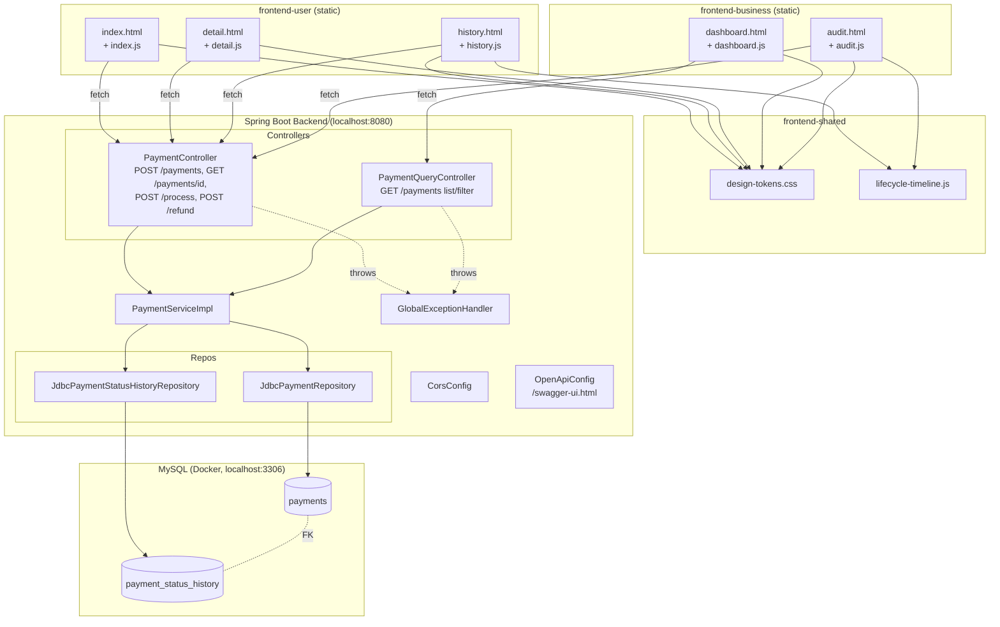
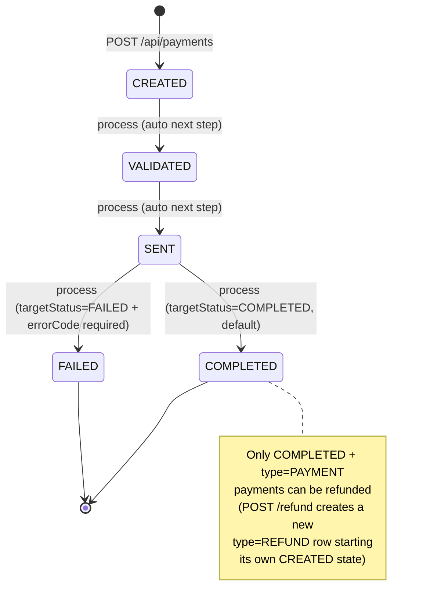
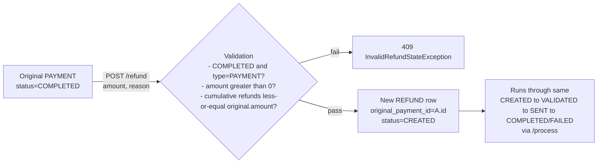

# Project Info — Payment Processing System

On-point reference doc. Source of truth for build/behavior is still `spec.md` — this
file is a quick-lookup index across features, endpoints, schema, Git/CI/CD, and
integration mechanics. Update alongside `spec.md` when things change.

---

## 1. Planned Features List

Updated 2026-08-05 for the product.md v3.0 "BND AI Billing and Payment Processing
Engine" redesign — see `spec.md` for full detail. Phase 1 (schema + seed data) is in
progress; everything below is the **target** feature set for Phases 2-6, not all of it
is implemented yet (see Section 2/3 status).

- Customer (Kishore) buys AI credit packs (Starter/Pro/Scale) via an invoice-based
  checkout, paying by Card or Bank Transfer in INR, USD, or EUR.
- Invoices carry subtotal/GST(18%)/total; GST breakdown shown in the UI.
- Multi-currency payments convert to a USD settlement amount via seeded exchange rates
  (Neha's scope — see `spec.md` Section 6.1).
- Payment methods are tokenized/masked only — never raw card or bank account numbers.
- Core payment lifecycle unchanged: `CREATED → VALIDATED → SENT → COMPLETED|FAILED`,
  plus a settlement lifecycle (`NOT_READY → PENDING → SETTLED`).
- Refunds are now a first-class `refunds` table (not a `type=REFUND` payment row):
  request → business approve/reject → process to completion, capped cumulatively at the
  original payment amount, multiple partial refunds allowed.
- Two frontends: customer checkout (`frontend-user`) and business ops dashboard
  (`frontend-business`), both getting a visual redesign in Phases 3-4.
- Lifecycle Playback Mode: Demo mode auto-plays scenarios, Debug mode exposes raw
  request/response + manual transition buttons (Phase 5).
- OpenAPI/Swagger docs auto-generated from the backend.
- Local MySQL via Docker Compose, seeded with a deterministic dataset covering Kishore's
  demo scenarios plus bulk data for 14 other customers (`spec.md` Section 11).

Out of scope for now (see `spec.md` Section 3 / product.md Section 5): auth/login, real
payment gateway or live FX calls, UPI/wallets/autopay, notifications, batch processing.

## 2. Feature → Ownership Mapping

Full detail in `spec.md` Section 6. The old per-module (M1-M4) ownership split from the
pre-redesign MVP phase is retired — ownership is now a simple two-way split:

| Owner | Scope |
|---|---|
| Neha | Multi-currency implementation only: `exchange_rates` read access, FX lookup/conversion service, currency selection handling, USD conversion calculation, FX-related response fields, conversion tests. |
| Tharan | Everything else: spec/schema/data generator, invoice feature, payment method masking/token model, customer checkout UI, business dashboard UI, demo/debug mode, refund workflow, security notes, all remaining API integration. |

Current phase: **Phase 1 (schema, seed data, spec rewrite) is IN_PROGRESS** on
`feature/p1-schema-seed`. `schema.sql` and `data.sql` are rewritten for the new 7-table
model; backend domain code (`Payment`/`PaymentServiceImpl`/etc.) is intentionally out of
sync and will not compile until Phase 2 rewrites it. See `spec.md` Section 2 for the
live status dashboard.

## 3. REST Endpoints

Target contract for the redesign (`spec.md` Section 7) — **all NOT_IMPLEMENTED as of
Phase 1**; the previously-working M1-M4 endpoints below are now stale/superseded because
the schema they were built against has been replaced (Phase 1), and Phase 2 has not yet
rewritten the backend to match:

| Endpoint | Method | Owner | Purpose | Status |
|---|---|---|---|---|
| `/api/bootstrap` | GET | Tharan | Checkout bootstrap data | NOT_IMPLEMENTED |
| `/api/invoices` | POST | Tharan | Create an invoice for a credit pack | NOT_IMPLEMENTED |
| `/api/payments` | POST | Tharan (+Neha FX fields) | Create a payment against an invoice | NOT_IMPLEMENTED |
| `/api/payments/{id}` | GET | Tharan | Fetch payment by id | NOT_IMPLEMENTED |
| `/api/payments` | GET | Tharan | List/filter/search payments (paginated) | NOT_IMPLEMENTED |
| `/api/payments/{id}/history` | GET | Tharan | Full status history timeline | NOT_IMPLEMENTED |
| `/api/payments/{id}/process` | POST | Tharan | Advance payment to next valid state | NOT_IMPLEMENTED |
| `/api/payments/{id}/refund` | POST | Tharan | Request a refund | NOT_IMPLEMENTED |
| `/api/refunds/{id}/approve` | POST | Tharan | Approve a pending refund | NOT_IMPLEMENTED |
| `/api/refunds/{id}/reject` | POST | Tharan | Reject a pending refund | NOT_IMPLEMENTED |
| `/api/business/dashboard` | GET | Tharan | Business KPI aggregates | NOT_IMPLEMENTED |
| `/api/demo/scenarios` | GET | Tharan | List seeded demo scenarios (Phase 5) | NOT_IMPLEMENTED |

Full request/response JSON shapes and error codes: `spec.md` Section 7. All error
responses use one shared `ErrorResponse` shape (timestamp, status, errorCode, message, path).

Live interactive docs once the app is running: `http://localhost:8080/swagger-ui.html`
(raw spec at `/v3/api-docs`) — configured via `springdoc.*` properties in
`application.properties` and `OpenApiConfig.java`.

## 4. UI Wireframes (text description — no image assets yet)

Updated 2026-08-05: both apps are now single unified pages (the original
index/history/detail and dashboard/audit page split was retired — those six legacy
files no longer exist in the repo).

**`frontend-user/` (end-customer app) — `index.html` + `script.js` + `styles.css`:**
- KPI insight cards (total payments, total amount, refunds, success rate) fed by
  `GET /api/payments/insights`.
- "New Payment" form: source account, destination account, amount, currency (free-text,
  defaults `INR`), idempotency key → submit → result card showing new payment id + status.
- Expandable recent-transactions list with inline detail (status badge, lifecycle
  timeline, refund action when `COMPLETED`).
- Demo mode auto-advances the lifecycle; Debug mode exposes manual step buttons + a
  request/response inspector (both via `frontend-shared/app-mode.js`).

**`frontend-business/` (internal ops app) — `ops.html` + `ops.js` + `ops.css`:**
- KPI strip (total payments, total amount, success rate, refund rate, pending
  approvals) fed by `GET /api/payments/insights`.
- Filter panel (status, type, payment method, approval status, source/destination
  account, date range) over a paginated results table.
- Detail panel (opened via a table row's "View" button): full payment info, lifecycle
  timeline (`frontend-shared/lifecycle-timeline.js`), and refund Approve/Reject actions
  when a refund is `PENDING_APPROVAL`.
- Same Demo/Debug mode infrastructure as `frontend-user`.

**`frontend-shared/`** — `design-tokens.css` (colors/spacing/typography vars, HSBC red
brand, dark-mode overrides), `lifecycle-timeline.js` (reusable timeline component), and
`app-mode.js` (Demo/Debug mode + dark-mode toggle persistence), consumed by both apps.
No page-specific logic lives here.

No dedicated wireframe image files (Figma/PNG) exist in the repo — the scaffolded HTML
files above are the working wireframes.

## 5. DB Schema

Rewritten 2026-08-05 (Phase 1) to the 7-table BND AI Billing model. Canonical source:
`backend/src/main/resources/schema.sql` (mirrors `spec.md` Section 4). Applied
automatically on every backend startup via `spring.sql.init.mode=always`.

| Table | Purpose | Key columns |
|---|---|---|
| `customers` | Customer identity | `customer_ref` (unique, e.g. `CUS-KISHORE-001`), `display_name`, `email`, `default_currency` |
| `exchange_rates` | Seeded FX rates | `from_currency`/`to_currency`, `rate` DECIMAL(18,8), `effective_at`, `source` |
| `invoices` | What the customer owes pre-payment | `invoice_number` (unique), `customer_id` FK, `product_name`/`product_code`, `credit_units`, `subtotal_amount`/`gst_amount`/`total_amount`, `currency`, `status` |
| `payment_methods` | Tokenized/masked method refs | `customer_id` FK, `method_type` (`CARD`/`BANK_TRANSFER`), `masked_identifier`, `token_ref`, `provider` |
| `payments` | Core payment engine record | `invoice_id`/`customer_id`/`payment_method_id` FKs, `idempotency_key` (unique), `amount`/`currency`, `exchange_rate_id` FK (nullable), `fx_rate`, `usd_amount`, `status`, `settlement_status`, `error_code` |
| `payment_status_history` | Append-only audit trail | `payment_id` FK, `from_status`/`to_status`, `changed_at`, `triggered_by`, `note`, `seq` (ordering tiebreaker) |
| `refunds` | First-class refund workflow | `payment_id` FK, `amount`/`currency`/`usd_amount`, `reason`, `approval_status`, `status`, `approved_by`/`approved_at`, `rejection_reason` |

Full column-by-column detail: `spec.md` Section 4. Key structural changes vs. the
previous 2-table model: `payments.source_account`/`destination_account`/`type`/
`original_payment_id`/`payment_method` (enum)/`approval_status`/`approved_by`/
`approved_at`/`rejection_reason` are all dropped — refunds are now their own table with
their own approval workflow, and payments gain invoice/customer/payment-method/FX
linkage plus a dedicated `settlement_status`.

Seed data: `backend/src/main/resources/data.sql` — 15 customers, 3 exchange rates, 175
invoices, 30 payment methods, 169 payments, 645 status-history rows, 23 refunds,
generated deterministically by `scripts/generate_data_sql.py` (one-time generator, not
part of the build). Verified to load cleanly against a throwaway MySQL database with
matching row counts (Phase 1).

## 6. Git Repo + Owner + Collaborators

- Repo (mono-repo, backend + frontend together): `https://github.com/Neueda-Learning/109_10_Brand_New_Day`
- Org/owner: `Neueda-Learning`
- Structure: **monorepo** — `backend/` (Spring Boot) and `frontend/` (3 static apps) in one repository, no submodules.
- Default branch: `main` (only branch currently — no feature branches pushed yet, despite the branch naming convention defined in `spec.md` Section 16).
- Collaborators list is not fetchable from local Git metadata — check
  `https://github.com/Neueda-Learning/109_10_Brand_New_Day/settings/access` (needs repo
  admin access) or run `gh api repos/Neueda-Learning/109_10_Brand_New_Day/collaborators`
  with the GitHub CLI authenticated.

## 7. Commit History Logger

No automated logger configured. Current history (`git log --oneline`), newest first:

| Commit | Message |
|---|---|
| `ee0ed21` (HEAD, main, origin/main) | Spring boot version updated to 4.1.0 - Compilation done |
| `f2d78a8` | Readme updated |
| `09cd886` | Merge branch 'main' of https://github.com/Neueda-Learning/109_10_Brand_New_Day |
| `58c12f3` | Updating the Template of the Project |
| `8d5dbc0` | Initial commit |

To keep a running log going forward: `git log --oneline --all > commit-history.log`
(regenerate on demand), or add a scheduled GitHub Action that commits this file
periodically — not currently set up.

## 8. Git PR Logger

No pull requests have been opened yet — all commits so far are direct pushes/merges to
`main`. `spec.md` Section 16 defines the intended PR policy (small PRs, 1 reviewer
minimum, no merge without passing tests) but it isn't enforced by branch protection yet.

Recommended (not yet set up): enable GitHub branch protection on `main` (require PR +
1 approval + status checks) and track PRs via `gh pr list --state all` for a point-in-time log.

## 9. Git Merge & Conflicts Logger

One merge commit exists so far: `09cd886` ("Merge branch 'main' of ...") — a routine
remote-sync merge, no recorded conflicts. No conflict-tracking tooling is set up; if/when
conflicts occur, resolution notes should be added to `spec.md` Section 18 (Progress Log)
by whoever resolves them, since this repo doesn't have PR-based conflict logging yet
(see Section 8 above).

## 10. Frontend ↔ Backend Integration — How It Works

- Frontends are **plain static HTML/CSS/JS** — no build step, no bundler, no framework.
  Served independently of the backend (e.g. a static file server on `localhost:5500` or
  opened directly), while the backend runs on `localhost:8080`.
- Integration is pure `fetch()` calls from page-specific JS files (e.g. `index.js`,
  `dashboard.js`) directly to the REST endpoints in Section 3, using relative/absolute
  URLs pointing at `http://localhost:8080/api/...`.
- Because frontend and backend are served from different origins/ports, **CORS must be
  explicitly enabled** — `backend/.../config/CorsConfig.java` allows the local dev
  frontend origins (`localhost:5500`, `localhost:3000`). Without this, browser `fetch()`
  calls fail with a CORS error even though the API works fine via curl/Postman.
- No shared session/auth token mechanism exists yet (auth is out of scope — Section 5).
- Data flow is request/response only — no WebSockets/polling; the UI reflects state only
  when the user triggers an action or reloads/refetches.

## 11. Testing (Unit / Integration)

Per `spec.md` Section 15:
- **Unit tests** — required per module, for the logic that module owns (e.g. M2's status
  transition rules, M3's refund cap/refund-of-refund checks).
- **Negative-path tests** — required for invalid state transitions, invalid refund
  states, and idempotency conflicts.
- **Repository tests** — required for JDBC SQL behavior (`JdbcPaymentRepository`,
  `JdbcPaymentStatusHistoryRepository`), run against a real local MySQL instance.
- Test dependency: `spring-boot-starter-test` (already in `pom.xml`); also
  `spring-boot-webmvc-test` (test scope, added by M3 — see `spec.md` Section 6.2).
- Environment prerequisite: MySQL running locally — standard command is
  `docker compose up -d` (see Section 13 below) before running integration/repository tests.
- Baseline before the Phase 1 schema rewrite: 78/78 tests passing (`mvn test`,
  `BUILD SUCCESS`, verified on `fix/pre-phase3-cleanup`/`main`, commit `991c4fc`).
- As of Phase 1 (`feature/p1-schema-seed`), the backend does **not** compile — this is
  expected: `schema.sql` was rewritten to the 7-table model but `Payment`/
  `PaymentServiceImpl`/`JdbcPaymentRepository`/etc. still reference the old dropped
  columns. Compilation and the full test suite are restored at the start of Phase 2.

## 12. GitHub Actions File for CI

**Not set up yet** — no `.github/workflows/` directory exists in this repo. Suggested
minimal starter (not yet added — create only when the team is ready to adopt CI):

```yaml
# .github/workflows/backend-ci.yml
name: Backend CI
on:
  push:
    branches: [main]
  pull_request:
    branches: [main]
jobs:
  build:
    runs-on: ubuntu-latest
    steps:
      - uses: actions/checkout@v4
      - uses: actions/setup-java@v4
        with:
          distribution: temurin
          java-version: '25'
      - name: Build (no tests DB available in CI yet)
        working-directory: backend
        run: mvn -q -DskipTests compile
```
A full test-inclusive pipeline would additionally need a MySQL service container
(`services: mysql: image: mysql:8.0 ...`) matching `schema.sql`/`data.sql`.

## 13. Dockerfile

**Not set up yet** — there is no `Dockerfile` for the Spring Boot app itself; only
`docker-compose.yml` at the repo root, which provisions **MySQL only** (see Section 14).
A basic app Dockerfile would look like:

```dockerfile
# backend/Dockerfile (not yet created)
FROM eclipse-temurin:25-jre
WORKDIR /app
COPY target/*.jar app.jar
ENTRYPOINT ["java", "-jar", "app.jar"]
```
(would need `mvn package` to produce the jar first, and a matching build stage or CI step).

## 14. Docker Compose

`docker-compose.yml` (repo root) — currently **MySQL only**, no app service defined yet:

```yaml
services:
  mysql:
    image: mysql:8.0
    container_name: bnd-pp-mysql
    environment:
      MYSQL_DATABASE: payment_processing
      MYSQL_USER: payment_app
      MYSQL_PASSWORD: payment_app
      MYSQL_ROOT_PASSWORD: root
    ports:
      - "3306:3306"
    volumes:
      - bnd-pp-mysql-data:/var/lib/mysql
    healthcheck:
      test: ["CMD", "mysqladmin", "ping", "-h", "localhost", "-u", "root", "-proot"]
```
Standard local dev command: `docker compose up -d`. Note: `application.properties`
must point at credentials that actually match whichever MySQL instance is running
(this compose file's `payment_app`/`payment_app`, or a separately-installed native
MySQL server) — see the troubleshooting notes already captured in this session.

## 15. Jenkins Job

**Not set up.** No `Jenkinsfile` exists in the repo, and there's no indication a Jenkins
server is in use for this project — GitHub Actions (Section 12) is the more likely CI
fit given the repo already lives on GitHub. Add a `Jenkinsfile` only if the team
specifically adopts Jenkins.

## 16. ngrok

**Not set up.** No ngrok config/scripts in the repo. Would only be relevant for exposing
the local backend (`localhost:8080`) to the internet temporarily (e.g. demoing to someone
outside the network): `ngrok http 8080`. Not part of the current local dev workflow
(frontend and backend both run on `localhost` today).

## 17. CI/CD

**Not set up.** Current workflow is fully manual:
1. `mvn -q -DskipTests compile` locally to verify the build.
2. Manual `git push` to `main` (no PR/branch-protection gate yet — see Section 8).
3. No automated deploy target exists (no cloud/hosting config found in the repo).

Recommended future path once the team is ready: GitHub Actions for CI (Section 12) →
branch protection + required PR reviews (Section 8) → containerize with a `Dockerfile`
(Section 13) → optional CD step to push the built image somewhere. None of this is
implemented yet; this section will need updating once any of it lands.

## 18. System Architecture & State Transitions

High-level architecture and lifecycle diagrams for the whole system (derived from
`spec.md` Sections 7-10, 14).

### 18.1 System Architecture



Key points:
- Two independent static frontends (`frontend-user`, `frontend-business`) call the same
  backend REST API — no server-side rendering.
- `frontend-shared` is dependency-only (CSS tokens + timeline JS component), consumed by
  both apps, contains no page-specific logic.
- Backend is layered Controller → Service → JDBC Repository, no ORM.
- `GlobalExceptionHandler` is the single cross-cutting error-mapping layer for all
  controllers, producing the shared `ErrorResponse` shape (spec Section 10.7).
- `CorsConfig` is the only cross-origin bridge between the frontend static origin(s)
  (`localhost:5500`/`3000`) and the backend (`localhost:8080`).

### 18.2 Payment Lifecycle State Transitions



### 18.3 Refund Sub-Flow

A refund is a brand-new `payments` row (`type=REFUND`), not a mutation of the original,
and it re-enters the same state machine independently (spec Section 8.1).



---

*Keep this file in sync with `spec.md` and `README.md` whenever the stack, endpoints, or
tooling change. `spec.md` remains the single source of truth for build behavior — this
file is a cross-cutting index for project-management/tooling concerns.*
