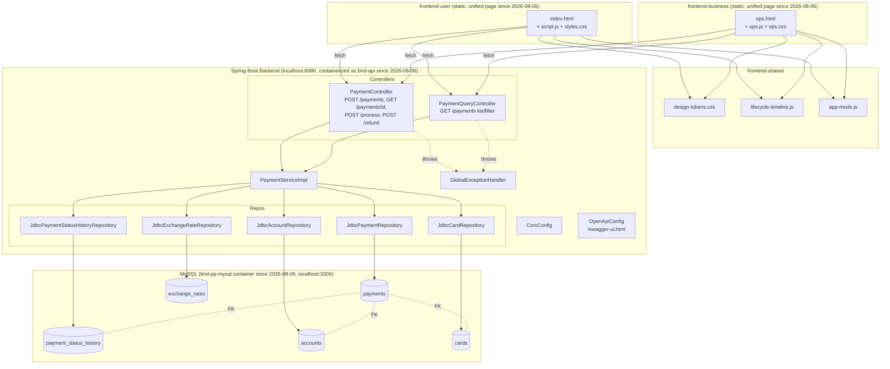
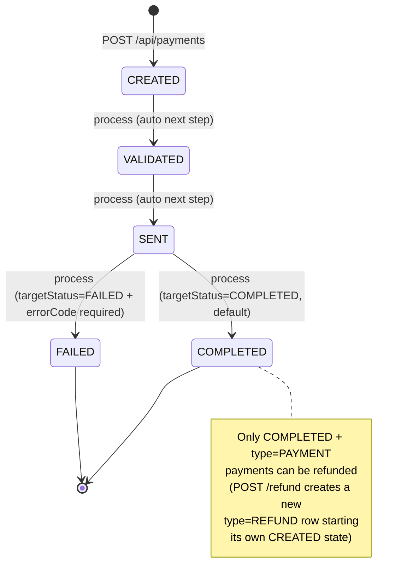
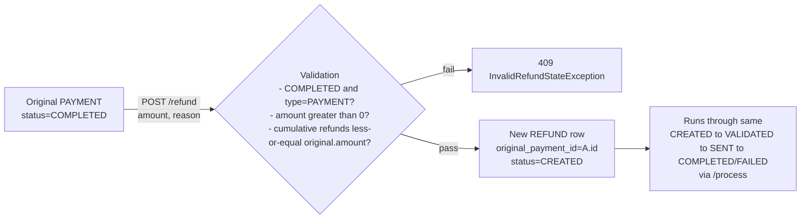

# Project Info — Payment Processing System

On-point reference doc. Source of truth for build/behavior is still `spec.md` — this
file is a quick-lookup index across features, endpoints, schema, Git/CI/CD, and
integration mechanics. Update alongside `spec.md` when things change.

---

## 1. Planned Features List

- Create a payment (`CREATED` status, idempotent on `idempotencyKey`), via `BANK_TRANSFER`
  or `CARD` (added 2026-08-06), in `INR`/`USD`/`EUR` (always settled in INR at a fixed
  seeded FX rate — added 2026-08-06).
- Fetch a payment by id.
- List/search/filter payments (by status, type, source/destination account, payment
  method, approval status, date range) with pagination.
- Full status-change audit trail (history timeline) per payment.
- Advance a payment through its lifecycle one step at a time (`process` endpoint):
  `CREATED → VALIDATED → SENT → COMPLETED|FAILED`.
- Refunds: create a `REFUND`-type payment against a `COMPLETED` original, capped at the
  original amount cumulative across multiple partial refunds, no refund-of-refund, gated
  behind a business approve/reject workflow.
- Bank-grade validation (added 2026-08-06): source/destination accounts must exist and be
  `ACTIVE` in the `accounts` registry; `CARD` payments validate against the `cards`
  registry (never persisting PAN/CVV); unsupported currencies are rejected.
- Two frontends: end-customer "payment gateway" checkout app (`frontend-user`) and
  internal ops app (`frontend-business`).
- OpenAPI/Swagger docs auto-generated from the backend.
- Local MySQL via Docker Compose, seeded with a realistic multi-week dataset incl.
  Kishore's demo accounts/card and USD/EUR payments.

Out of scope for now (see `spec.md` Section 5): real payment gateway/processor
integration, authentication/authorization, notifications, batch processing.

## 2. Feature → Dev Mapping

Full detail in `spec.md` Section 9. Summary (updated 2026-08-05 — both frontends are now
single unified pages, not the original per-module page split):

| Module | Owner | Feature scope | Backend files | Frontend page(s) |
|---|---|---|---|---|
| M1 — Creation & Validation | Poornima | Create payment, get-by-id, input validation | `PaymentController`, `PaymentService(Impl)`, `PaymentRepository`/`JdbcPaymentRepository` (create/get) | `frontend-user/index.html` |
| M2 — Status Engine & Audit Trail | Neha | `process` transitions, status history | `PaymentController` (process), `PaymentStatusHistoryRepository`/`Jdbc...` | `frontend-business/ops.html` |
| M3 — Idempotency, Errors, Refund | Tharan | Idempotency short-circuit, refund rules, refund approval workflow, exception handling | `GlobalExceptionHandler`, exception classes, refund service/repo logic | `frontend-user/index.html`, `frontend-business/ops.html` (approve/reject) |
| M4 — Query API, Lifecycle UI, Design System, API Docs, Insights | Karuna | Search/filter/paginate, aggregate insights, shared UI components, OpenAPI config | `PaymentQueryController`, `PaymentAnalyticsService(Impl)`, `OpenApiConfig`, `frontend-shared/*` | `frontend-business/ops.html`, `frontend-user/index.html` |

Current phase: **Phase 2 (backend/frontend implementation) is DONE for M1-M4, merged to
`main`**, including the refund approval workflow and the `/insights` aggregate endpoint.
Both frontends were unified into single-page apps (`frontend-user/index.html`,
`frontend-business/ops.html`) on 2026-08-05, replacing the original
index/history/detail and dashboard/audit page split. A 2026-08-06 bank-grade hardening
pass added `accounts`/`cards`/`exchange_rates` tables, multi-currency (INR/USD/EUR,
settled in INR) and a `CARD` payment method. `frontend-user` is now being redesigned as a
bank-grade "payment gateway" checkout (Kishore-only account/card selection, animated
lifecycle-simulation overlay, no debug/manual-step UI on the customer side) — see
`spec.md` Section 2 for the live status dashboard.

## 3. REST Endpoints

| Endpoint | Method | Owner | Purpose | Status |
|---|---|---|---|---|
| `/api/payments` | POST | M1 (+M3 idempotency) | Create payment | TESTED |
| `/api/payments/{id}` | GET | M1 | Fetch payment by id | TESTED |
| `/api/payments` | GET | M4 | List/filter/search payments (paginated) | TESTED |
| `/api/payments/insights` | GET | M4 | Aggregate KPI/analytics for dashboards | TESTED |
| `/api/payments/{id}/history` | GET | M2 | Full status history timeline | TESTED |
| `/api/payments/{id}/process` | POST | M2 | Advance payment to next valid state | TESTED |
| `/api/payments/{id}/refund` | POST | M3 | Create refund against a completed payment | TESTED |
| `/api/payments/{id}/refund/approve` | POST | M3 | Approve a pending refund | TESTED |
| `/api/payments/{id}/refund/reject` | POST | M3 | Reject a pending refund | TESTED |

Full request/response JSON shapes and error codes: `spec.md` Section 10. All error
responses use one shared `ErrorResponse` shape (timestamp, status, errorCode, message, path).

Live interactive docs once the app is running: `http://localhost:8080/swagger-ui.html`
(raw spec at `/v3/api-docs`) — configured via `springdoc.*` properties in
`application.properties` and `OpenApiConfig.java`.

## 4. UI Wireframes (text description — no image assets yet)

Updated 2026-08-05: both apps are now single unified pages (the original
index/history/detail and dashboard/audit page split was retired — those six legacy
files no longer exist in the repo).

**`frontend-user/` (end-customer app) — `index.html` + `script.js` + `styles.css`:**
- KPI insight cards (total payments, total amount, refunds, success rate) fed by
  `GET /api/payments/insights`.
- "New Payment" checkout form (bank-grade, Kishore-only demo identity — no auth/login):
  from-account dropdown (Kishore's 2 seeded accounts), free-text destination account,
  amount, currency select (`INR`/`USD`/`EUR`), payment method toggle (Bank Transfer /
  Card — card option reveals a card picker + CVV field with a "never stored" notice) →
  submit → an animated "processing" overlay auto-advances the new payment's lifecycle
  (`CREATED → VALIDATED → SENT → COMPLETED`/`FAILED`) via repeated
  `POST .../process` calls, rendered live with `frontend-shared/lifecycle-timeline.js`.
- Expandable recent-transactions list with inline detail (status badge, lifecycle
  timeline, settlement/FX amount when currency ≠ INR, card brand/last4 when paid by
  card, refund action when `COMPLETED`).
- Light/dark theme toggle via `frontend-shared/app-mode.js`. No Demo/Debug mode toggle
  or request/response inspector on this app — the customer-facing checkout always
  auto-advances (prod-grade UX); Debug mode remains business-side only (`ops.html`).

**`frontend-business/` (internal ops app) — `ops.html` + `ops.js` + `ops.css`:**
- KPI strip (total payments, total amount, success rate, refund rate, pending
  approvals) fed by `GET /api/payments/insights`.
- Filter panel (status, type, payment method, approval status, source/destination
  account, date range) over a paginated results table.
- Detail panel (opened via a table row's "View" button): full payment info, lifecycle
  timeline (`frontend-shared/lifecycle-timeline.js`), and refund Approve/Reject actions
  when a refund is `PENDING_APPROVAL`.
- Same Demo/Debug mode infrastructure as `frontend-user`.

**`frontend-shared/`** — `design-tokens.css` (colors/spacing/typography vars, HSBC red
brand, dark-mode overrides), `lifecycle-timeline.js` (reusable timeline component), and
`app-mode.js` (Demo/Debug mode + dark-mode toggle persistence), consumed by both apps.
No page-specific logic lives here.

No dedicated wireframe image files (Figma/PNG) exist in the repo — the scaffolded HTML
files above are the working wireframes.

## 5. DB Schema

Canonical source: `backend/src/main/resources/schema.sql` (mirrors `spec.md` Section 7).
Applied automatically on every backend startup via `spring.sql.init.mode=always`.
Extended 2026-08-06 with a bank-grade validation hardening pass: `accounts`/`cards`/
`exchange_rates` reference tables plus new `payments` columns for multi-currency
settlement and card snapshots.

**`accounts`** — reference registry simulating a core-banking existence/status check
(not FK-linked from `payments`): `id`, `account_number` (unique), `customer_ref`,
`display_name`, `account_type` (`CUSTOMER`/`BUSINESS`), `status`
(`ACTIVE`/`BLOCKED`/`CLOSED`), `default_currency`, `created_at`/`updated_at`.

**`cards`** — PCI-safe demo card registry (no PAN/CVV columns, ever): `id`,
`customer_ref`, `card_brand`, `masked_pan`, `last4`, `expiry_month`/`expiry_year`,
`cardholder_name`, `token_ref` (unique), `status` (`ACTIVE`/`BLOCKED`), `created_at`.

**`exchange_rates`** — fixed/seeded FX rates, no live FX calls: `id`, `currency`
(unique), `rate_to_inr`, `effective_at`, `source`. Seeded with `INR` (1.0), `USD`
(95.2), `EUR` (109.92).

**`payments`**

| Column | Type | Notes |
|---|---|---|
| id | CHAR(36) PK | server-generated UUID |
| idempotency_key | VARCHAR(255) UNIQUE | dedupe key for create |
| source_account | VARCHAR(64) | |
| destination_account | VARCHAR(64) | |
| amount | DECIMAL(18,2) | in `currency`, not necessarily INR |
| currency | VARCHAR(3) | `INR`/`USD`/`EUR` (must exist in `exchange_rates`) |
| status | VARCHAR(20) | `CREATED`/`VALIDATED`/`SENT`/`COMPLETED`/`FAILED` |
| error_code | VARCHAR(64) NULL | set only when `FAILED` |
| type | VARCHAR(10) | `PAYMENT` / `REFUND` |
| original_payment_id | CHAR(36) NULL FK→payments.id | set only for `REFUND` rows |
| payment_method | VARCHAR(20) | `BANK_TRANSFER` / `CARD` |
| approval_status / approved_by / approved_at / rejection_reason | | `REFUND` rows only |
| settlement_currency / fx_rate_to_inr / settlement_amount_inr | | frozen at creation, always settles in INR |
| requested_by | VARCHAR(64) NULL | initiating account/actor |
| card_id / card_last4 / card_brand | | snapshot, only set when `payment_method = CARD` |
| created_at / updated_at | TIMESTAMP | UTC |

Indexes: `status`, `type`, `source_account`, `destination_account`, `created_at`,
`original_payment_id`.

**`payment_status_history`**

| Column | Type | Notes |
|---|---|---|
| id | CHAR(36) PK | |
| payment_id | CHAR(36) FK→payments.id | |
| from_status | VARCHAR(20) NULL | null for the initial `CREATED` row |
| to_status | VARCHAR(20) | |
| changed_at | TIMESTAMP | UTC |
| triggered_by | VARCHAR(32) | e.g. `SYSTEM` |
| note | VARCHAR(255) NULL | |
| seq | BIGINT AUTO_INCREMENT UNIQUE | insertion-order tiebreaker, not exposed via API |

Index: `(payment_id, changed_at, seq)`.

Seed data: `backend/src/main/resources/data.sql` — deterministic, generated by
`scripts/generate_data_sql.py` (one-time generator, not part of the build); includes
Kishore's 2 accounts + 1 VISA card and USD/EUR multi-currency payments.

## 6. Git Repo + Owner + Collaborators

- Repo (mono-repo, backend + frontend together): `https://github.com/Neueda-Learning/109_10_Brand_New_Day`
- Org/owner: `Neueda-Learning`
- Structure: **monorepo** — `backend/` (Spring Boot) and `frontend/` (3 static apps) in one repository, no submodules.
- Default branch: `main` (only branch currently — no feature branches pushed yet, despite the branch naming convention defined in `spec.md` Section 16).
- Collaborators list is not fetchable from local Git metadata — check
  `https://github.com/Neueda-Learning/109_10_Brand_New_Day/settings/access` (needs repo
  admin access) or run `gh api repos/Neueda-Learning/109_10_Brand_New_Day/collaborators`
  with the GitHub CLI authenticated.

## 7. Commit History Logger

No automated logger configured. Current history (`git log --oneline`), newest first:

| Commit | Message |
|---|---|
| `ee0ed21` (HEAD, main, origin/main) | Spring boot version updated to 4.1.0 - Compilation done |
| `f2d78a8` | Readme updated |
| `09cd886` | Merge branch 'main' of https://github.com/Neueda-Learning/109_10_Brand_New_Day |
| `58c12f3` | Updating the Template of the Project |
| `8d5dbc0` | Initial commit |

To keep a running log going forward: `git log --oneline --all > commit-history.log`
(regenerate on demand), or add a scheduled GitHub Action that commits this file
periodically — not currently set up.

## 8. Git PR Logger

No pull requests have been opened yet — all commits so far are direct pushes/merges to
`main`. `spec.md` Section 16 defines the intended PR policy (small PRs, 1 reviewer
minimum, no merge without passing tests) but it isn't enforced by branch protection yet.

Recommended (not yet set up): enable GitHub branch protection on `main` (require PR +
1 approval + status checks) and track PRs via `gh pr list --state all` for a point-in-time log.

## 9. Git Merge & Conflicts Logger

One merge commit exists so far: `09cd886` ("Merge branch 'main' of ...") — a routine
remote-sync merge, no recorded conflicts. No conflict-tracking tooling is set up; if/when
conflicts occur, resolution notes should be added to `spec.md` Section 18 (Progress Log)
by whoever resolves them, since this repo doesn't have PR-based conflict logging yet
(see Section 8 above).

## 10. Frontend ↔ Backend Integration — How It Works

- Frontends are **plain static HTML/CSS/JS** — no build step, no bundler, no framework.
  Served independently of the backend (e.g. a static file server on `localhost:5500` or
  opened directly), while the backend runs on `localhost:8080`.
- Integration is pure `fetch()` calls from page-specific JS files (e.g. `index.js`,
  `dashboard.js`) directly to the REST endpoints in Section 3, using relative/absolute
  URLs pointing at `http://localhost:8080/api/...`.
- Because frontend and backend are served from different origins/ports, **CORS must be
  explicitly enabled** — `backend/.../config/CorsConfig.java` allows the local dev
  frontend origins (`localhost:5500`, `localhost:3000`). Without this, browser `fetch()`
  calls fail with a CORS error even though the API works fine via curl/Postman.
- No shared session/auth token mechanism exists yet (auth is out of scope — Section 5).
- Data flow is request/response only — no WebSockets/polling; the UI reflects state only
  when the user triggers an action or reloads/refetches.

## 11. Testing (Unit / Integration)

Per `spec.md` Section 15:
- **Unit tests** — required per module, for the logic that module owns (e.g. M2's status
  transition rules, M3's refund cap/refund-of-refund checks).
- **Negative-path tests** — required for invalid state transitions, invalid refund
  states, and idempotency conflicts.
- **Repository tests** — required for JDBC SQL behavior (`JdbcPaymentRepository`,
  `JdbcPaymentStatusHistoryRepository`), run against a real local MySQL instance.
- Test dependency: `spring-boot-starter-test` (already in `pom.xml`); also
  `spring-boot-webmvc-test` (test scope, added by M3 — see `spec.md` Section 6.2).
- Environment prerequisite: MySQL running locally — standard command is
  `docker compose up -d` (see Section 13 below) before running integration/repository tests.
- 29 tests currently passing across `GlobalExceptionHandlerTest`,
  `JdbcPaymentRepositoryTest`, and `PaymentServiceImplTest` (verified via `mvn test` on
  `feature/m4-lifecycle-ui` after merging latest `main`).

## 12. GitHub Actions File for CI

**Implemented (added 2026-08-06)** — `.github/workflows/backend-ci.yml` and
`.github/workflows/frontend-ci.yml`, both path-filtered to their respective folders.

`backend-ci.yml`: checkout → JDK 25 (temurin) → MySQL 8.4 service container
(`root`/`n3u3da!`, db `payment_processing`) → `chmod +x mvnw` → `./mvnw clean verify`.
On `push` to `main` only: log in to GHCR, build/push `ghcr.io/neueda-learning/bnd-api:latest`,
then curl-trigger the Jenkins `bnd-api-deploy-job` (Section 15) using the
`JENKINS_URL`/`JENKINS_TOKEN` repo secrets.

`frontend-ci.yml`: checkout (no build step needed — static files only). On `push` to
`main` only: build/push `ghcr.io/neueda-learning/bnd-ui:latest`, then curl-trigger the
Jenkins `bnd-ui-deploy-job`.

Full contract and diagram: `spec.md` Section 20.

## 13. Dockerfile

**Implemented (added 2026-08-06):**

`backend/Dockerfile` — multi-stage: `eclipse-temurin:25-jdk` builds the jar via
`./mvnw -DskipTests package`, then `eclipse-temurin:25-jre` runs it (`EXPOSE 8080`).
Self-contained — `docker build backend` works standalone, not just from CI.

`frontend/Dockerfile` — `nginx:alpine` + `COPY . /usr/share/nginx/html`, serving
`frontend-user/`, `frontend-business/`, `frontend-shared/` at their existing relative
paths (no bundler/build step, per the Section 4 hard constraint).

Both folders also have a matching `.dockerignore` (`target/`/`.git`/docs excluded).

## 14. Docker Compose

`docker-compose.yml` (repo root) — **replaced 2026-08-06** with a full 3-service
deployment stack (previously MySQL-only):

```yaml
services:
  mysql:      # bnd-pp-mysql, MySQL 8.4, port 3306
  api:        # bnd-api, ghcr.io/neueda-learning/bnd-api:latest, 8082:8080
  ui:         # bnd-ui, ghcr.io/neueda-learning/bnd-ui:latest, 8081:80
```
Credentials (`root`/`n3u3da!`) now match `application.properties` exactly, closing the
divergence this section used to document. Standard deploy command:
`docker compose pull && docker compose up -d`. For plain local iterative development
without Docker, `mvn spring-boot:run` / `.\mvnw.cmd spring-boot:run` against a
standalone MySQL is still fully supported (see README.md Getting Started).

## 15. Jenkins Job

**Documented, external to this repo (added 2026-08-06)** — no `Jenkinsfile` is needed;
Jenkins is used as two Freestyle jobs with "Trigger builds remotely" enabled, called by
the GitHub Actions workflows (Section 12) via `curl`:

| Job | Trigger URL pattern |
|---|---|
| `bnd-api-deploy-job` | `.../job/bnd-api-deploy-job/build?token=<token>` |
| `bnd-ui-deploy-job` | `.../job/bnd-ui-deploy-job/build?token=<token>` |

Each job's build step runs `docker compose pull && docker compose down && docker compose
up -d` on the deploy host. Provisioning the actual Jenkins server is external
infrastructure, not part of this repo/workspace — see `spec.md` Section 20.4.

## 16. ngrok

**Documented, external to this repo (added 2026-08-06)** — used only to expose the
Jenkins server so GitHub Actions' `curl` trigger can reach it:
```bash
ngrok config add-authtoken <YOUR_NGROK_AUTHTOKEN>
ngrok http 8080
```
The resulting `https://xxxx.ngrok-free.app` URL becomes the `JENKINS_URL` GitHub secret
(Section 12). Not part of the local dev workflow itself.

## 17. CI/CD

**Implemented (added 2026-08-06)** — end-to-end pipeline:
1. `git push` to `main` (or open a PR — CI still runs, deploy steps are push-only).
2. GitHub Actions (Section 12) builds/tests, then builds+pushes Docker images to GHCR.
3. GitHub Actions `curl`s the Jenkins deploy job (via ngrok, Section 16) using the
   `JENKINS_URL`/`JENKINS_TOKEN` repo secrets.
4. Jenkins (Section 15) runs `docker compose pull/down/up -d` on the deploy host using
   the root `docker-compose.yml` (Section 14).

Full reference/diagram: `spec.md` Section 20. Branch protection + required PR reviews
(Section 8) are still not enforced — recommended next step, not yet implemented.

## 18. System Architecture & State Transitions

High-level architecture and lifecycle diagrams for the whole system (derived from
`spec.md` Sections 7-10, 14).

### 18.1 System Architecture



Key points:
- Two independent static frontends (`frontend-user`, `frontend-business`) call the same
  backend REST API — no server-side rendering.
- `frontend-shared` is dependency-only (CSS tokens + timeline JS component), consumed by
  both apps, contains no page-specific logic.
- Backend is layered Controller → Service → JDBC Repository, no ORM.
- `GlobalExceptionHandler` is the single cross-cutting error-mapping layer for all
  controllers, producing the shared `ErrorResponse` shape (spec Section 10.7).
- `CorsConfig` is the only cross-origin bridge between the frontend static origin(s)
  (`localhost:5500`/`3000`) and the backend (`localhost:8080`).
- As of 2026-08-06, both apps also run containerized (`bnd-api`/`bnd-ui` images, built
  and pushed to GHCR by CI, served via the root `docker-compose.yml`) as an alternative
  to local `mvn spring-boot:run` + Live Server — see Section 17 / `spec.md` Section 20.

### 18.2 Payment Lifecycle State Transitions



### 18.3 Refund Sub-Flow

A refund is a brand-new `payments` row (`type=REFUND`), not a mutation of the original,
and it re-enters the same state machine independently (spec Section 8.1).



---

*Keep this file in sync with `spec.md` and `README.md` whenever the stack, endpoints, or
tooling change. `spec.md` remains the single source of truth for build behavior — this
file is a cross-cutting index for project-management/tooling concerns.*
