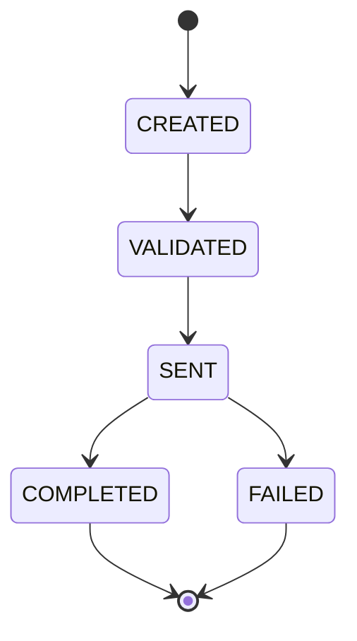

# Payment Processing System - Unified Specification & Progress Log

Status: ACTIVE (living document — update it as work progresses)
Version: 2.2
Last Updated: 2026-08-05
Source of Truth: This file only.

## 1. How to Use This Spec

This is the only spec file for this project. It is both the **build spec** and the
**project history / progress log**. Do not rely on the separate template/master-prompt
files during implementation — they were used to bootstrap this document only.

Any developer or AI agent should be able to open this single file and immediately know:
- What the system does and its boundaries (Section 5).
- Who owns which module, and exactly what APIs/pages/tasks they must deliver (Section 9).
- The exact request/response contract for every endpoint (Section 10).
- How to scaffold the backend/frontend backbone from nothing (Section 11).
- What phase the project is in and what is done vs. pending (Section 2 — Status Dashboard,
  and Section 18 — Progress Log).

Rules:
- If a data shape, endpoint, or dependency is missing here, add it to this spec first —
  do not guess or invent requirements while coding.
- Keep Section 2 (Status Dashboard) and Section 18 (Progress Log) up to date whenever a
  task, endpoint, or page is completed. This is how progress is tracked — there is no
  separate lock/review gate blocking implementation.

## 2. Project Status Dashboard

Update this table whenever work completes. This is the fastest way for anyone (human or
agent) to see current project state at a glance.

| Module | Owner | Phase 1 - Backbone | Phase 2 - Backend Impl | Phase 2 - Frontend Impl | Phase 3 - Integration | Notes |
|---|---|---|---|---|---|---|
| Shared setup (pom.xml, schema.sql, docker-compose, config) | Team | DONE | — | — | IN_PROGRESS | Maven skeleton, `schema.sql`, `docker-compose.yml`, `CorsConfig`/`JdbcConfig`/`OpenApiConfig` all created and compiling |
| Shared dataset (data.sql seed) | Team | DONE | — | — | DONE | 491 payments / 1661 history rows generated via `scripts/generate_data_sql.py` — see Section 11.5 |
| M1 - Creation & Validation | Poornima | DONE | DONE | DONE | IN_PROGRESS | `POST /api/payments` + `GET /api/payments/{id}` implemented; `index.html`/`index.js` wired to real API (PR #1, merged) |
| M2 - Status Engine & Audit Trail | Neha | DONE | DONE | DONE | IN_PROGRESS | `process`/`history` endpoints implemented; `audit.html`/`audit.js` wired to real API (PR #3, merged) |
| M3 - Idempotency, Errors, Refund | Tharan | DONE | DONE | DONE | IN_PROGRESS | Idempotency short-circuit, refund rules, full `GlobalExceptionHandler` mapping implemented; `detail.html`/`detail.js` wired to real API (PR #2, merged). v2.2 (`feature/m3-refund-approval`): payment method tagging, refund approval workflow, refund idempotency key, `FOR UPDATE` concurrency fix — implemented and tested 2026-08-05, not yet merged to `main` |
| M4 - Query API, Lifecycle UI, Design System, API Docs | Karuna | DONE | DONE | DONE | IN_PROGRESS | `GET /api/payments` filter/pagination + `lifecycle-timeline.js`/`dashboard.html`/`history.html` implemented and unit-tested; on `feature/m4-lifecycle-ui`, not yet merged to `main`. **Frontend UI portion superseded 2026-08-05** — see the full frontend redesign note below (`ops.html` plan replaced by unified `frontend-business/index.html`, built and using client-side KPI computation pending the real `/insights` endpoint, which remains `NOT_STARTED`) |

Status values: `NOT_STARTED`, `IN_PROGRESS`, `DONE`, `BLOCKED`.
Overall project phase: **Phase 2 (Backend/Frontend Impl) — DONE for M1-M4 on their respective branches. Phase 3 (cross-module integration validation, e.g. end-to-end refund/process/query flows together, PR review, merge of `feature/m4-lifecycle-ui` into `main`) is IN_PROGRESS.**

**v2.2 scope (added 2026-08-05):** payment method, refund approval workflow, insights
endpoint, and the unified business frontend (Sections 4/5/7/8.1/9/10/14/16) are
**spec-approved**, and `feature/m3-refund-approval` (payment method tagging + refund
approval workflow + refund idempotency + concurrency fix) is now **DONE** (backend +
tests; see 2026-08-05 Progress Log entry below). The remaining v2.2 branches
(`feature/shared-dataset-v2`, `feature/m4-insights-api`) are still **NOT_STARTED**.

**Full frontend redesign (added 2026-08-05, later same day):** both `frontend-user/`
and `frontend-business/` were rebuilt from scratch into single unified, Bootstrap-styled,
HSBC-branded pages (`index.html`/`script.js`/`styles.css` in each folder) with a
GPay/PhonePe-style layout, animated lifecycle timeline, and a Demo/Debug mode toggle —
**DONE** (frontend only; see Section 14 for the as-built layout, Section 18 for the full
changelog). This work was done ahead of and independent from `feature/m4-insights-api`;
both new pages compute KPI/insight data client-side via a swappable `computeInsights()`
helper until the real `GET /api/payments/insights` endpoint exists. The old
`feature/m4-business-ui` plan name `ops.html`/`ops.js`/`ops.css` was **superseded** by
`frontend-business/index.html`/`script.js`/`styles.css` to mirror the `frontend-user`
naming; all 6 legacy pages (`frontend-user/{history,detail}.html`+`.js`,
`frontend-business/{dashboard,audit}.html`+`.js`) were deleted.

## 3. Session Context Block (Optional — for AI session hygiene)

Copy and fill this block at the top of a new chat when working on a specific module:

| Field | Value |
|---|---|
| Name | Tharan / Poornima / Neha / Karuna |
| Module | M1 / M2 / M3 / M4 / Shared |
| Active Task | Example: scaffold pom.xml, M3 refund endpoint |
| Blockers | None or describe |

## 4. Hard Constraints (Non-Negotiable)

- Backend stack: Spring Boot + Maven + Java 25.
- Data access: Spring JDBC only (JdbcTemplate or NamedParameterJdbcTemplate).
- Database: MySQL only.
- No JPA, no Hibernate, no Spring Data repositories.
- No authentication or authorization code.
- No logging of full account/card numbers; use masking.
- Frontend only plain HTML/CSS/JS.
- No frontend frameworks or build tools.
- Exception (added 2026-08-05): Bootstrap 5 (CSS + `bundle.js`) and Bootstrap Icons,
  loaded only via CDN `<link>`/`<script>` tags, are explicitly whitelisted. No `npm
  install`, no bundler, no build step of any kind — this is the only permitted
  framework/library exception, and no other UI library may be added without a further
  spec amendment.
- No unnecessary dependencies.
- No endpoint, field, or workflow outside this spec.

## 5. Project Scope

Internal payment processing system with:
- Payment creation and validation
- Status transition engine
- Audit history
- Idempotency behavior
- Refund creation flow
- Refund approval workflow (business must approve/reject a refund before it can be
  processed to completion — added 2026-08-05, see Section 8.1 rule 6 and Section 9's
  updated M3 section)
- Payment method tagging (extensible field, single supported value `BANK_TRANSFER` for
  now — added 2026-08-05, see Section 7 and Section 9's updated M3 section)
- Query/list APIs
- Analytics/insights aggregate endpoint for the business dashboard (added 2026-08-05,
  see Section 9's updated M4 section and Section 10.10)
- Shared lifecycle UI structure

Out of scope:
- Real payment gateway integration
- Authentication/authorization
- External processor integrations
- Multi-currency support — all payments are `INR` only for now. Multi-currency is a
  possible future feature, not currently assigned to any module (M1-M4), and must not be
  built or seeded until it is added to this spec with an owner.

## 6. Tech Stack and Dependency Policy

### 6.1 Platform

- Java: 25
- Build tool: Maven
- Framework: Spring Boot 4.x latest stable (currently `4.1.0`, requires springdoc-openapi
  `3.x` — see Section 6.2)
- Data access: spring-boot-starter-jdbc
- Validation: spring-boot-starter-validation
- Database driver: com.mysql:mysql-connector-j
- API docs: springdoc-openapi
- Testing: spring-boot-starter-test, spring-boot-webmvc-test (test-scope only — see Section 6.2)

### 6.2 Minimal Dependency Whitelist

Allowed dependencies only:
- org.springframework.boot:spring-boot-starter-web
- org.springframework.boot:spring-boot-starter-jdbc
- org.springframework.boot:spring-boot-starter-validation
- com.mysql:mysql-connector-j
- org.springdoc:springdoc-openapi-starter-webmvc-ui
- org.springframework.boot:spring-boot-starter-test
- org.springframework.boot:spring-boot-webmvc-test (test scope) — required as of Spring Boot
  4.1.0, which moved `@WebMvcTest`/`@AutoConfigureMockMvc` out of
  `spring-boot-test-autoconfigure` into this new artifact; not transitively pulled in by
  `spring-boot-starter-test`. Added by M3 for `GlobalExceptionHandlerTest`.

### 6.3 Denylist

Do not add:
- spring-boot-starter-data-jpa
- org.hibernate:*
- spring-boot-starter-security
- Any frontend framework dependency
- Any code generation framework unless explicitly approved by team review

## 7. Domain Model and Schema (Canonical and Intact)

This schema is the baseline contract and must remain intact unless a reviewed amendment is made here first.

```sql
payments (
  id                  UUID PK,
  idempotency_key     VARCHAR UNIQUE,
  source_account      VARCHAR,
  destination_account VARCHAR,
  amount              DECIMAL(18,2),
  currency            VARCHAR(3),  -- always "INR" for now, see Section 5
  status              VARCHAR,     -- CREATED | VALIDATED | SENT | COMPLETED | FAILED
  error_code          VARCHAR NULL,
  type                VARCHAR,     -- PAYMENT | REFUND
  original_payment_id UUID NULL,   -- set when type = REFUND
  payment_method      VARCHAR(20) NOT NULL DEFAULT 'BANK_TRANSFER',  -- added 2026-08-05
  approval_status     VARCHAR(20) NULL,  -- NULL | PENDING_APPROVAL | APPROVED | REJECTED, REFUND rows only (added 2026-08-05)
  approved_by         VARCHAR(64) NULL,  -- added 2026-08-05
  approved_at         TIMESTAMP NULL,    -- added 2026-08-05
  rejection_reason    VARCHAR(255) NULL, -- added 2026-08-05
  created_at          TIMESTAMP,
  updated_at          TIMESTAMP
)

payment_status_history (
  id           UUID PK,
  payment_id   UUID FK,
  from_status  VARCHAR NULL,
  to_status    VARCHAR,
  changed_at   TIMESTAMP,
  triggered_by VARCHAR,
  note         VARCHAR NULL,
  seq          BIGINT AUTO_INCREMENT UNIQUE  -- insertion-order tiebreaker, not exposed via API
)
```

Schema invariants:
- `idempotency_key` must be unique.
- `payment_status_history` is append-only (no updates/deletes).
- Status transitions must follow the rules in Section 8.
- REFUND rows must reference `original_payment_id`.
- No speculative fields — do not add columns without updating this section first.
- `payment_status_history.seq` (added 2026-08-04) is an `AUTO_INCREMENT` tiebreaker used
  only for `ORDER BY changed_at ASC, seq ASC` in `GET /api/payments/{id}/history` — since
  `changed_at` is second-precision, multiple transitions landing in the same second would
  otherwise sort non-deterministically/incorrectly. Never returned in any API response.
- `amount` is stored with exactly 2 decimal places (rupees + paise). Reject/round-reject
  requests with more than 2 decimal places at validation time — never silently round.
- `id` (and every other UUID column) is **always generated server-side**
  (`java.util.UUID.randomUUID()`), never accepted from the client. Clients only ever
  supply `idempotencyKey` as their own correlation value.
- All `TIMESTAMP` columns are stored and returned in **UTC**. Frontend pages are
  responsible for any local-time display conversion; the API never converts timezones.
- `payment_method` (added 2026-08-05): a single supported value today, `BANK_TRANSFER`;
  the column exists so future methods (e.g. `CARD`/`UPI`/`WALLET`) can be added later
  without a schema change. No per-method validation/behavior branching exists yet.
- `approval_status`/`approved_by`/`approved_at`/`rejection_reason` (added 2026-08-05):
  only ever set on `type = REFUND` rows. Stays `NULL` for `type = PAYMENT` rows. Set to
  `PENDING_APPROVAL` at refund creation time; see Section 8.1 rule 6 for the full
  approval-gate rule and Section 9 (M3) for the owning endpoints.

## 8. State and Transition Rules

Allowed payment states:
- `CREATED`
- `VALIDATED`
- `SENT`
- `COMPLETED`
- `FAILED`

Transition diagram:



Rules:
- `CREATED -> VALIDATED`: validation rules pass (M1 validates on creation; M2 owns the
  `process` endpoint that performs the actual transition).
- `VALIDATED -> SENT`: simulated dispatch to a payment processor (no real gateway).
- `SENT -> COMPLETED` or `SENT -> FAILED`: terminal outcome of simulated processing —
  see Section 8.2 for exactly how this outcome is decided (it is not automatic/random).
- `COMPLETED` and `FAILED` are terminal — no further transitions allowed, and there is no
  automatic retry. If a business wants to retry a `FAILED` payment, that means a brand
  new `POST /api/payments` call with a new `idempotencyKey` — this system does not
  auto-create retry attempts.
- A `type = REFUND` payment goes through this exact same state machine as a normal
  payment (see Section 8.1) — it is not instantly `COMPLETED`.
- Every transition (via `POST /api/payments/{id}/process`) must append one row to
  `payment_status_history` with `from_status`, `to_status`, `changed_at`, `triggered_by`.
- Any attempt to transition a payment already in a terminal state must fail with
  `InvalidStatusTransitionException` (M2 owns this rule; M3 owns the exception's error
  mapping/response shape).
- Refunds (M3) are a separate `type = REFUND` payment row, not a state on the original
  payment. A refund may only be created when the original payment's status is
  `COMPLETED`. A `type = REFUND` payment can **never** itself be the target of another
  refund (no refund-of-refund chains) — see Section 8.1.

### 8.1 Refund Mechanism (Full Rules, Plain English)

This is the complete, unambiguous definition of how a refund works end to end:

1. A refund is requested via `POST /api/payments/{originalId}/refund` against an
   **existing, `COMPLETED`, `type = PAYMENT`** row. Attempting this against any other
   status, or against a payment that is already `type = REFUND`, always fails with
   `InvalidRefundStateException` (`409`).
2. A refund is **not** an in-place field on the original payment and it does **not**
   instantly complete. Creating a refund inserts a **brand-new `payments` row** with:
   - `type = REFUND`
   - `original_payment_id = <the original payment's id>`
   - `status = CREATED` (its own fresh lifecycle start)
   - its own `payment_status_history` row: `null -> CREATED`, `triggered_by = SYSTEM`.
3. That new refund row must then be advanced through the **same** state machine as any
   other payment, via the **same** `POST /api/payments/{refundId}/process` endpoint
   (`CREATED -> VALIDATED -> SENT -> COMPLETED`/`FAILED`), until it reaches `COMPLETED`.
   A refund is only considered "done" once its own status is `COMPLETED`.
4. **Amount limit is cumulative, not just against the single request:** a refund's
   `amount` must be `> 0`, and `(sum of amounts of all prior — any status — refund rows
   for this `original_payment_id`) + (this new refund's amount)` must be
   `<= original payment.amount`. This prevents over-refunding across multiple partial
   refunds. Violating this returns `InvalidRefundStateException` (`409`).
   - Example: a ₹1000 original payment can have a ₹400 refund and later a ₹600 refund
     (total ₹1000, allowed), but a third refund of any amount after that is rejected.
   - A refund whose amount exactly equals the original payment's full remaining
     refundable amount is a valid "full refund" — no special-cased field is needed.
5. Refunding a `REFUND` row itself (i.e. `original_payment_id` pointing at a payment
   where `type = REFUND`) is always rejected with `InvalidRefundStateException`,
   regardless of that refund row's own status.
6. **Approval gate (added 2026-08-05):** every new refund row is created with
   `approval_status = PENDING_APPROVAL`. A refund's status can **never** advance past
   `CREATED` (i.e. `POST /api/payments/{refundId}/process` for `CREATED -> VALIDATED`)
   until a business user explicitly approves it via
   `POST /api/payments/{refundId}/refund/approve` (Section 10.8). Attempting to
   `process` a refund that is not yet `APPROVED` fails with `RefundNotApprovedException`
   (`409`, Section 10.7). Rejecting a refund via
   `POST /api/payments/{refundId}/refund/reject` (Section 10.9) sets
   `approval_status = REJECTED` and moves the refund's own `status` straight to
   `FAILED` (with `error_code = 'REFUND_REJECTED'`) via the normal
   `payment_status_history` mechanism — no new payment status was introduced for this;
   it reuses the existing terminal `FAILED` state. Approval/rejection never applies to
   `type = PAYMENT` rows.

### 8.2 Process Outcome Rule (What Decides `SENT -> COMPLETED` vs `SENT -> FAILED`)

Since there is no real payment gateway, the outcome of the one branching step in the
state machine is **caller-controlled, not random**, so behavior is deterministic and
testable:

- For `CREATED -> VALIDATED` and `VALIDATED -> SENT`, `POST /api/payments/{id}/process`
  always advances to the single next status — there is no choice to make.
- For the `SENT -> {COMPLETED | FAILED}` step only, the request body may include an
  optional `targetStatus` field (`"COMPLETED"` or `"FAILED"`). If omitted, the default
  is `"COMPLETED"`.
- If `targetStatus` is `"FAILED"`, the request **must** also include an `errorCode`
  string (stored on the payment's `error_code` column and in the history row's `note`).
  Omitting `errorCode` while requesting `"FAILED"` is a `400 VALIDATION_ERROR`.
- Supplying `targetStatus` on any transition other than `SENT -> *` (or supplying a value
  other than `COMPLETED`/`FAILED`) is rejected as `InvalidStatusTransitionException`
  (`409`).
- See Section 10.5 for the exact `ProcessRequest` JSON shape.

### 8.3 Concurrency & Transaction Rules

Because this project uses raw Spring JDBC (no ORM/JPA managing transactions for you),
every module owner must wrap the following in an explicit `@Transactional` method (or
equivalent single DB transaction) — this is not optional polish, it's required for
correctness:

- **Create + idempotency check (M1/M3):** never "SELECT to check, then INSERT" as two
  separate steps with a race window. Rely on the `idempotency_key` UNIQUE constraint:
  attempt the insert, and on a duplicate-key violation, re-fetch and return the existing
  row as the `200 OK` short-circuit response. Both the existence check and the insert
  must happen inside one transaction.
- **Status transition + history insert (M2):** the `payments.status`/`updated_at` update
  and the new `payment_status_history` row must be written in a single transaction. Use
  a conditional update (e.g. `UPDATE payments SET status = :new WHERE id = :id AND
  status = :expectedCurrent`) and check the affected row count — if it's `0`, another
  concurrent request already moved the payment, so throw `InvalidStatusTransitionException`
  rather than blindly overwriting.
- **Refund creation (M3):** computing the cumulative refunded total (Section 8.1, rule 4)
  and inserting the new refund row must happen in the same transaction, so two concurrent
  refund requests against the same payment can't both pass the amount check.

## 9. Roles & Module Ownership — End-to-End Responsibility Matrix

Each module below lists everything that module's owner is responsible for: backend
files, APIs (with request/response contracts — see Section 10 for full JSON shapes),
frontend pages, and the concrete task list for each phase. Read your module's section
top to bottom and you have your complete assignment.

---

### M1 — Creation & Validation — Owner: Poornima

**Mission:** Let a user submit a new payment and retrieve a payment by id, with correct
input validation.

**Backend files owned:**
- `payment/controller/PaymentController.java` — `POST /api/payments`, `GET /api/payments/{id}`
- `payment/service/PaymentService.java` / `PaymentServiceImpl.java` — `createPayment()`, `getPayment()`
- `payment/repository/PaymentRepository.java` / `JdbcPaymentRepository.java` — insert/select payment rows
- `payment/dto/CreatePaymentRequest.java`, `PaymentResponse.java`
- `payment/model/Payment.java`, `PaymentStatus.java`, `PaymentType.java`

**APIs owned:**
| API | Method | Purpose |
|---|---|---|
| `/api/payments` | POST | Create a new payment (initial status `CREATED`). Shares idempotency short-circuit behavior owned by M3. |
| `/api/payments/{id}` | GET | Fetch a single payment by id (shared read path also used by M2/M3). |

**In plain English:** the create endpoint is "open a new payment record" — it does not
move money or contact anything external, it just validates the input and writes one row
with `status = CREATED`. The get-by-id endpoint is a plain lookup used everywhere else
in the system (M2's process/history screens and M3's refund screen all start by fetching
a payment by id first).

**Validation rules (Bean Validation, on `CreatePaymentRequest`):**
- `sourceAccount`, `destinationAccount`: required, non-blank.
- `sourceAccount != destinationAccount`.
- `amount`: required, `> 0`.
- `currency`: required, 3-letter ISO code. Only `INR` is used/seeded for now (see
  Section 5 — multi-currency is out of scope); the field stays a free 3-letter code so
  it does not need a schema change if multi-currency is added later.
- `idempotencyKey`: required, non-blank (consumed by M3's idempotency logic on the create path).

**Frontend owned:**
- `frontend/frontend-user/index.html` — "new payment" form (source/destination account,
  amount, currency, submit). Calls `POST /api/payments`.
- Uses shared design tokens/components from M4 (`frontend/frontend-shared/`).

**Phase 1 tasks (backbone):**
- [x] Create controller/service/repository/dto class skeletons for the create/get flow.
- [x] Stub methods throw `UnsupportedOperationException` until Phase 2.
- [x] Scaffold `frontend/frontend-user/index.html` with the form markup (no wired JS logic yet).

**Phase 2 tasks (implementation):**
- [ ] Implement `POST /api/payments` (validation + insert + initial history row `null -> CREATED`).
- [ ] Implement `GET /api/payments/{id}` (404 via `PaymentNotFoundException` if missing).
- [ ] Wire `index.html` JS to call the real API and show success/validation errors.

**Depends on:** M3 for idempotency short-circuit behavior on `POST /api/payments`;
M4 for shared CSS/JS design tokens and the lifecycle timeline component (used to show
payment status right after creation).

**Definition of done:** Both endpoints implemented and covered by unit + repository
tests (Section 15); user can create a payment via the UI and see it return a payment id.

---

### M2 — Status Engine & Audit Trail — Owner: Neha

**Mission:** Move a payment through its lifecycle and expose a full, append-only audit
trail of every transition.

**Backend files owned:**
- `payment/controller/PaymentController.java` — `POST /api/payments/{id}/process`, `GET /api/payments/{id}/history`
- `payment/service/PaymentService.java` / `PaymentServiceImpl.java` — `processTransition()`, `getHistory()`
- `payment/repository/PaymentStatusHistoryRepository.java` / `JdbcPaymentStatusHistoryRepository.java`
- `payment/model/PaymentStatusHistory.java`
- `payment/dto/PaymentHistoryEntry.java`, `ProcessRequest.java`

**APIs owned:**
| API | Method | Purpose |
|---|---|---|
| `/api/payments/{id}/process` | POST | Advance a payment to the next valid status per Section 8's state machine. |
| `/api/payments/{id}/history` | GET | Return the full ordered status-history timeline for a payment. |

**In plain English:** the process endpoint is the only way a payment ever changes
status — there is no background job, so a human or test script must call it once per
step (`CREATED->VALIDATED`, then `VALIDATED->SENT`, then `SENT->COMPLETED`/`FAILED`).
The history endpoint is a read-only, ordered log of every step a payment has ever taken
— think of it as the payment's timeline/receipt trail.

**Business rules:**
- Enforces the transition table in Section 8, including the caller-controlled
  `SENT -> COMPLETED`/`FAILED` outcome rule defined in **Section 8.2**. Any invalid
  transition throws `InvalidStatusTransitionException` (error-mapped by M3).
- Every successful transition appends exactly one `payment_status_history` row and
  updates `payments.status` + `updated_at` in the same operation. This must be one
  database transaction — see **Section 8.3** for the exact concurrency-safe pattern
  (conditional update + row-count check).
- `FAILED` is fully terminal — no automatic retry payment is ever created by this
  system (Section 8).
- History is read-only and append-only — never updated or deleted.

**Frontend owned:**
- `frontend/frontend-business/audit.html` — business-facing audit trail screen; lists a
  payment's full history timeline. Calls `GET /api/payments/{id}/history`.
- Uses the shared `lifecycle-timeline.js` component (owned by M4) to render the
  timeline visually.

**Phase 1 tasks (backbone):**
- [x] Create status-transition and history skeleton files (service + repository stubs).
- [x] Add transition method stubs only (no rule logic yet).
- [x] Scaffold `frontend/frontend-business/audit.html` with static markup for a timeline.

**Phase 2 tasks (implementation):**
- [ ] Implement `processTransition()` with the full state machine from Section 8.
- [ ] Implement `GET /api/payments/{id}/history` returning ordered entries (oldest first).
- [ ] Wire `audit.html` to fetch and render a real payment's history via
  `lifecycle-timeline.js`.

**Depends on:** M1 for the initial `CREATED` row and payment existence; M3 for the
`InvalidStatusTransitionException` error response shape; M4 for the shared timeline
component and design tokens.

**Definition of done:** State machine fully enforced with negative-path tests (invalid
transition attempts rejected); history endpoint returns complete, correctly ordered
timelines; audit UI renders a real payment's lifecycle.

---

### M3 — Idempotency, Errors, Refund — Owner: Tharan

**Mission:** Prevent duplicate payment creation, provide consistent error responses
across the whole API, and let a completed payment be refunded.

**Backend files owned:**
- `payment/controller/PaymentController.java` — `POST /api/payments/{id}/refund`,
  `POST /api/payments/{id}/refund/approve`, `POST /api/payments/{id}/refund/reject`
  (approve/reject added 2026-08-05)
- `payment/service/PaymentService.java` / `PaymentServiceImpl.java` — `createRefund()`,
  `approveRefund()`, `rejectRefund()` (added 2026-08-05), idempotency lookup logic used
  inside `createPayment()`. Recommended (not mandatory): split refund-specific logic into
  a dedicated `payment/service/RefundService.java`/`RefundServiceImpl.java` to keep
  `PaymentServiceImpl` from growing unbounded.
- `payment/model/PaymentMethod.java` (new, added 2026-08-05) — enum, single value
  `BANK_TRANSFER` today, designed to extend later without a shape change.
- `payment/dto/RefundRequest.java` (gains optional `idempotencyKey`, added 2026-08-05),
  `ErrorResponse.java`, new `ApproveRefundRequest.java`, `RejectRefundRequest.java`
  (added 2026-08-05)
- `common/exception/GlobalExceptionHandler.java`
- `common/exception/PaymentNotFoundException.java`, `InvalidStatusTransitionException.java`, `DuplicatePaymentException.java`, `InvalidRefundStateException.java`,
  new `RefundNotApprovedException.java` (added 2026-08-05)

**APIs owned:**
| API | Method | Purpose |
|---|---|---|
| `/api/payments/{id}/refund` | POST | Create a refund (`type = REFUND`) against a `COMPLETED` payment. |
| `/api/payments/{id}/refund/approve` | POST | Approve a `PENDING_APPROVAL` refund so it can proceed through `process` (added 2026-08-05). |
| `/api/payments/{id}/refund/reject` | POST | Reject a `PENDING_APPROVAL` refund; moves it straight to `FAILED` (added 2026-08-05). |

**In plain English:** the refund endpoint does not "undo" or delete the original
payment — it creates a **brand-new payment row** of `type = REFUND` linked back to the
original, which then has to run through the exact same lifecycle (`process` calls) as
any other payment before it's actually `COMPLETED`. See **Section 8.1** for the full,
step-by-step refund mechanism (including the cumulative-amount rule across multiple
partial refunds, and why a refund can never itself be refunded).

Also owns the **cross-cutting behavior** used by every other endpoint:
- Idempotency lookup performed during M1's `POST /api/payments` (by `idempotency_key`).
- The `GlobalExceptionHandler` and `ErrorResponse` shape used by all controllers.

**Business rules:**
- Idempotency: if `POST /api/payments` is called with an `idempotency_key` that already
  exists, do **not** create a new row — return `HTTP 200` with the original payment
  resource (see Section 1's global policy carried over from the API inventory). This
  check and the insert must be one transaction — see **Section 8.3**.
- Refund: only allowed when the original payment's `status = COMPLETED` and its
  `type = PAYMENT` (never `REFUND`). Refund amount must be `> 0`, and the **cumulative**
  total of this payment's refunds must stay `<= original payment.amount` — see
  **Section 8.1** for the full rule and worked example. Creates a new `payments` row
  with `type = REFUND`, `original_payment_id = <original id>`, initial
  `status = CREATED`, and its own history row `null -> CREATED`.
- Refunding a non-`COMPLETED` payment, or a payment that is already `type = REFUND`,
  throws `InvalidRefundStateException`.
- **Refund approval gate (added 2026-08-05):** a refund is created with
  `approval_status = PENDING_APPROVAL` and cannot advance past `CREATED` via `process`
  until approved — see Section 8.1 rule 6 for the full rule and Section 10.8/10.9 for
  the endpoint contracts.
- **Refund idempotency (added 2026-08-05):** `RefundRequest` accepts an optional
  `idempotencyKey`, reusing the same globally-unique `idempotency_key` column and
  duplicate-key-catch-and-refetch short-circuit pattern already used by
  `createPayment()`, so a double-submitted "Confirm Refund" click cannot create two
  refund rows.
- **Concurrency fix (added 2026-08-05):** the cumulative refund-amount cap check
  (Section 8.1 rule 4) must take a row lock (`SELECT ... FOR UPDATE`) on the original
  payment before computing the existing refunded sum, inside the same `@Transactional`
  method as the insert — closes a race window where two near-simultaneous refund
  requests could both pass the cap check before either commits.
- All exceptions map to a single consistent `ErrorResponse` JSON shape (Section 10)
  through `GlobalExceptionHandler` (`@ControllerAdvice`).

**Frontend owned:**
- `frontend/frontend-user/detail.html` — payment detail page with a "Refund" action
  button (visible only when status is `COMPLETED`). Calls `POST /api/payments/{id}/refund`.

**Phase 1 tasks (backbone):**
- [x] Create refund and idempotency skeleton methods (stubs only).
- [x] Create all exception classes and `GlobalExceptionHandler` skeleton (no mapping logic yet).
- [x] Scaffold `frontend/frontend-user/detail.html` with static payment detail + refund button markup.

**Phase 2 tasks (implementation):**
- [ ] Implement idempotency short-circuit inside M1's create flow.
- [ ] Implement `POST /api/payments/{id}/refund` with the rules above.
- [ ] Complete `GlobalExceptionHandler` mapping every custom exception to an `ErrorResponse`
      with the correct HTTP status code (Section 10.7).
- [ ] Wire `detail.html` to show payment details and trigger a real refund call.
- [ ] (Added 2026-08-05, branch `feature/m3-refund-approval`) Add the 5 new `payments`
      columns to `schema.sql`; implement `PaymentMethod` enum + wiring through
      `Payment`/`CreatePaymentRequest`/`PaymentResponse`/`PaymentMapper`.
- [ ] (Added 2026-08-05) Implement `approveRefund()`/`rejectRefund()` + the
      `refund/approve`/`refund/reject` endpoints and the `process()` approval guard.
- [ ] (Added 2026-08-05) Add optional `idempotencyKey` to `RefundRequest` and the
      matching short-circuit logic; add the `SELECT ... FOR UPDATE` concurrency fix.
- [ ] (Added 2026-08-05) Add `RefundNotApprovedException` + `GlobalExceptionHandler`
      mapping (409, `REFUND_NOT_APPROVED`).

**Depends on:** M1's create flow (to inject idempotency check); M2's status field (to
gate refund eligibility); M4 for shared design tokens on `detail.html`.

**Definition of done:** Duplicate `idempotency_key` never creates a second row;
refund only succeeds against `COMPLETED` payments; every error case across the whole
API returns the same `ErrorResponse` shape with an appropriate status code.

---

### M4 — Query API, Lifecycle UI, Design System, API Docs — Owner: Karuna

**Mission:** Let payments be listed/searched, provide the shared UI building blocks used
by every other frontend page, and publish API documentation.

**Backend files owned:**
- `payment/controller/PaymentQueryController.java` — `GET /api/payments`,
  `GET /api/payments/insights` (added 2026-08-05)
- `config/OpenApiConfig.java` — springdoc-openapi configuration
- (Added 2026-08-05) `payment/dto/PaymentInsightsResponse.java`; recommended new
  `payment/repository/PaymentAnalyticsRepository.java`/
  `JdbcPaymentAnalyticsRepository.java` and `payment/service/PaymentAnalyticsService.java`/
  `PaymentAnalyticsServiceImpl.java`, kept separate from the core payment lifecycle
  service/repository.

**APIs owned:**
| API | Method | Purpose |
|---|---|---|
| `/api/payments` | GET | List/filter/search payments (by `status`, `type`, `sourceAccount`, `destinationAccount`, `paymentMethod`, `approvalStatus`, date range; paginated). |
| `/api/payments/insights` | GET | Aggregate analytics for the business dashboard (added 2026-08-05, see Section 10.10). |

**In plain English:** `GET /api/payments` is the "browse/search everything" endpoint
used by the business dashboard — no id required, just optional filters, returned a page
at a time, newest first by default. `GET /api/payments/insights` (added 2026-08-05) is a
read-only aggregate/summary endpoint (totals, breakdowns by status/type, success rate,
pending-approval count) that powers the new business dashboard's KPI cards — it never
returns individual payment rows.

**Query parameters (all optional, combinable):**
`status`, `type`, `sourceAccount`, `destinationAccount`, `paymentMethod`,
`approvalStatus` (`paymentMethod`/`approvalStatus` added 2026-08-05), `fromDate`,
`toDate`, `page` (default 0), `size` (default 20).

**Routing note (added 2026-08-05):** `GET /api/payments/insights` is a literal path
segment, not a path variable, so it must not collide with `GET /api/payments/{id}` on
`PaymentController` — add an explicit `MockMvc` test proving requests to `/insights`
route to `PaymentQueryController`, not `PaymentController`'s `{id}` lookup (Section 15).

**Frontend owned (shared design system + business dashboards):**
- `frontend/frontend-shared/design-tokens.css` — shared colors, spacing, typography,
  status-badge colors (one badge style per `PaymentStatus`, plus 3 new badge colors for
  `PENDING_APPROVAL`/`APPROVED`/`REJECTED` added 2026-08-05), used by every page in both
  `frontend-user` and `frontend-business`. See Section 14.2 for the full brand/theming
  guidelines (light/dark mode, HSBC-style palette, icon rules — added 2026-08-05). **DONE.**
- `frontend/frontend-shared/lifecycle-timeline.js` — reusable vanilla-JS component that
  renders a `payment_status_history` array as a visual timeline, extended to also show
  the refund approval sub-state via an optional 3rd argument (added 2026-08-05). **DONE.**
  Consumed by both unified pages below.
- `frontend/frontend-shared/app-mode.js` (new, added 2026-08-05) — shared Debug/Demo mode
  toggle + light/dark theme toggle + `localStorage` persistence + auto-advance loop +
  request/response inspector helper. See Section 14.3. **DONE.**
- **(Added 2026-08-05) `frontend/frontend-business/index.html`/`script.js`/`styles.css`**
  — new unified business dashboard that **replaced** `dashboard.html`/`dashboard.js`/
  `audit.html`/`audit.js` (old files deleted). **DONE.** Renamed from the originally
  planned `ops.html`/`ops.js`/`ops.css` to mirror `frontend-user`'s naming. Single page:
  KPI cards (client-side `computeInsights()`, swappable for the real `/insights`
  endpoint once implemented) → filterable/searchable payments table (existing
  `status`/`type`/`sourceAccount`/`destinationAccount`/`fromDate`/`toDate` filters only —
  `paymentMethod`/`approvalStatus` filters were **not** added since that requires the
  still-`NOT_STARTED` `feature/m4-insights-api` backend work) → offcanvas detail panel
  with full history timeline → refund Approve/Reject actions. Loads Bootstrap 5 +
  Bootstrap Icons via CDN (Section 4 exception).
- **(Added 2026-08-05) `frontend/frontend-user/index.html`/`script.js`/`styles.css`** —
  rebuilt from scratch into a single unified consumer app (payment creation with
  auto-generated `idempotencyKey`, recent transactions list with inline
  expand/refund/timeline, KPI cards). **DONE.** Replaced the old `index.js` plus
  `history.html`/`history.js`/`detail.html`/`detail.js` (all deleted).

**Phase 1 tasks (backbone):**
- [x] Create `PaymentQueryController` skeleton (stub method only).
- [x] Add `OpenApiConfig` skeleton (empty `@Bean` for `OpenAPI` metadata).
- [x] Create `frontend/frontend-shared/design-tokens.css` with base tokens (colors, spacing).
- [x] Create `frontend/frontend-shared/lifecycle-timeline.js` with an empty component shell.
- [x] Scaffold `frontend/frontend-business/dashboard.html` and `frontend/frontend-user/history.html`.

**Phase 2 tasks (implementation):**
- [ ] Implement `GET /api/payments` filtering + pagination against JDBC.
- [ ] Finish `lifecycle-timeline.js` rendering logic and wire it into `audit.html` and `history.html`.
- [ ] Finish `dashboard.html` list/filter UI consuming the real query API.
- [ ] Finalize OpenAPI docs (`/swagger-ui.html` reachable, all endpoints documented).
- [ ] (Added 2026-08-05, branch `feature/m4-insights-api`) Implement
      `PaymentInsightsResponse` + analytics repository/service + `GET
      /api/payments/insights`; extend `GET /api/payments` filters with `paymentMethod`/
      `approvalStatus`; add the routing collision test noted above.
- [x] (Added 2026-08-05, frontend redesign) Build `frontend-business/index.html`/
      `script.js`/`styles.css` replacing `dashboard.*`/`audit.*`; rework
      `design-tokens.css` per Section 14.2; build `app-mode.js` + the Debug/Demo toggle
      per Section 14.3; delete the old 4 files. **DONE** — renamed from the originally
      planned `ops.html`/`ops.js`/`ops.css`; KPI cards use client-side
      `computeInsights()` pending `feature/m4-insights-api` above.

**Depends on:** All other modules' endpoints being stable enough to document; M1-M3's
pages consuming the shared CSS/JS files without modification.

**Definition of done:** List/filter API returns correct paginated results; every other
page in the project visually uses `design-tokens.css`; Swagger UI lists all six endpoints
correctly.

---

## 10. API Contract Reference

Master list — see Section 9 for who owns each one and the frontend page that consumes it.
The **Status** column is the per-endpoint implementation status (finer-grained than the
module-level Section 2 dashboard) — update it as each endpoint is actually built and
tested, independent of the rest of its module.

| API | Method | Owner | Purpose | Status |
|---|---|---|---|---|
| `/api/payments` | POST | M1 (+M3 idempotency) | Create payment | TESTED |
| `/api/payments/{id}` | GET | M1 | Fetch payment by id | TESTED |
| `/api/payments` | GET | M4 | List/filter/search payments | TESTED (on `feature/m4-lifecycle-ui`, not yet merged to `main`) |
| `/api/payments/{id}/history` | GET | M2 | Get full status history timeline | TESTED |
| `/api/payments/{id}/process` | POST | M2 | Advance payment to next valid state | TESTED |
| `/api/payments/{id}/refund` | POST | M3 | Create refund against a completed payment | TESTED |
| `/api/payments/{id}/refund/approve` | POST | M3 | Approve a pending refund (added 2026-08-05) | TESTED |
| `/api/payments/{id}/refund/reject` | POST | M3 | Reject a pending refund (added 2026-08-05) | TESTED |
| `/api/payments/insights` | GET | M4 | Aggregate analytics for business dashboard (added 2026-08-05) | NOT_IMPLEMENTED |

Endpoint status values: `NOT_IMPLEMENTED`, `IMPLEMENTED` (works, not yet tested),
`TESTED` (has passing unit/repository tests per Section 15).

Global API policy:
- No new endpoints outside this table without updating this spec first.
- Duplicate idempotency default policy: return `HTTP 200` with the original payment resource.
- All error responses use the single `ErrorResponse` shape (10.7).
- CORS: the backend must allow cross-origin requests from local dev frontend origins
  (e.g. a static file server on `http://localhost:5500` or similar) — see `CorsConfig.java`
  in Section 11.1. Without this, the plain-HTML frontend's `fetch()` calls will fail in
  the browser even though the API works fine from Postman/curl.

### 10.1 `POST /api/payments`

**What it does (plain English):** opens a brand-new payment record. Nothing is actually
"sent" yet — this only validates the input and writes one row with `status = CREATED`.
If the same `idempotencyKey` was already used, it does **not** create a second row; it
just hands back the original payment.

Request (`CreatePaymentRequest`):
```json
{
  "sourceAccount": "ACC-1001",
  "destinationAccount": "ACC-2002",
  "amount": 250.00,
  "currency": "INR",
  "paymentMethod": "BANK_TRANSFER",
  "idempotencyKey": "client-generated-uuid-or-key"
}
```
- `paymentMethod` (added 2026-08-05): optional; defaults server-side to
  `"BANK_TRANSFER"` if omitted. `"BANK_TRANSFER"` is the only supported value today
  (Section 7).

Response `201 Created` (new payment) or `200 OK` (duplicate `idempotencyKey`) — `PaymentResponse`:
```json
{
  "id": "b1e7...uuid",
  "idempotencyKey": "client-generated-uuid-or-key",
  "sourceAccount": "ACC-1001",
  "destinationAccount": "ACC-2002",
  "amount": 250.00,
  "currency": "INR",
  "status": "CREATED",
  "errorCode": null,
  "type": "PAYMENT",
  "originalPaymentId": null,
  "paymentMethod": "BANK_TRANSFER",
  "approvalStatus": null,
  "approvedBy": null,
  "approvedAt": null,
  "rejectionReason": null,
  "createdAt": "2026-08-04T10:00:00Z",
  "updatedAt": "2026-08-04T10:00:00Z"
}
```
- `approvalStatus`/`approvedBy`/`approvedAt`/`rejectionReason` (added 2026-08-05): always
  `null` for `type = PAYMENT` rows; only meaningful for `type = REFUND` rows
  (Section 8.1 rule 6, Section 10.6/10.8/10.9).

### 10.2 `GET /api/payments/{id}`

**What it does (plain English):** a plain lookup by id — no side effects. Used
everywhere else (process screen, history screen, refund screen) to load a payment
before acting on it.

Response `200 OK` — `PaymentResponse` (same shape as 10.1). `404` if not found.

### 10.3 `GET /api/payments`

**What it does (plain English):** the "browse/search everything" endpoint. All filters
are optional and combine with AND logic; results are always paginated.

Query params: `status`, `type`, `sourceAccount`, `destinationAccount`, `paymentMethod`,
`approvalStatus` (`paymentMethod`/`approvalStatus` added 2026-08-05), `fromDate`,
`toDate`, `page` (default `0`), `size` (default `20`).

- An unrecognized/invalid value for `status`, `type`, `paymentMethod`, or
  `approvalStatus` (i.e. not one of the enum values) returns `400 VALIDATION_ERROR` —
  never a `500` (`paymentMethod`/`approvalStatus` validation added 2026-08-05).
- `page` must be `>= 0`; `size` must be between `1` and `100` inclusive. Values outside
  these bounds return `400 VALIDATION_ERROR` — never a `500` (added 2026-08-05).
- Default sort order is `created_at DESC` (newest payments first) when no explicit
  ordering is requested. There is no sort-by query param in this MVP — a fixed default
  is enough.

Response `200 OK`:
```json
{
  "content": [ /* array of PaymentResponse */ ],
  "page": 0,
  "size": 20,
  "totalElements": 42
}
```

### 10.4 `GET /api/payments/{id}/history`

**What it does (plain English):** returns the full, ordered timeline of every status
change a payment has gone through — its audit trail/receipt log. Oldest entry first.

Response `200 OK` — array of `PaymentHistoryEntry`:
```json
[
  {
    "fromStatus": null,
    "toStatus": "CREATED",
    "changedAt": "2026-08-04T10:00:00Z",
    "triggeredBy": "SYSTEM",
    "note": null
  },
  {
    "fromStatus": "CREATED",
    "toStatus": "VALIDATED",
    "changedAt": "2026-08-04T10:01:00Z",
    "triggeredBy": "SYSTEM",
    "note": null
  }
]
```

### 10.5 `POST /api/payments/{id}/process`

**What it does (plain English):** advances a payment exactly one step in its lifecycle
(Section 8). There is no auto-advance/background job — something has to call this
endpoint once per step. For every step except the final one, there's nothing to choose;
for the final `SENT -> {COMPLETED|FAILED}` step, the caller decides the outcome via
`targetStatus` (see Section 8.2 for the full rule).

Request (`ProcessRequest`, all fields optional unless noted):
```json
{
  "targetStatus": "FAILED",
  "errorCode": "INSUFFICIENT_FUNDS",
  "note": "manual test of failure path"
}
```
- `targetStatus`: optional. Only meaningful when the payment's current status is `SENT`
  (values `"COMPLETED"` or `"FAILED"`, default `"COMPLETED"` if omitted). Ignored/invalid
  on any other current status — see Section 8.2.
- `errorCode`: **required if** `targetStatus = "FAILED"`; otherwise omit it.
- `note`: optional free-text stored on the resulting history row.

Response `200 OK` — updated `PaymentResponse`. `409` (`InvalidStatusTransitionException`)
if the payment is already in a terminal state, or if `targetStatus`/`errorCode` are used
incorrectly per Section 8.2. `400 VALIDATION_ERROR` if `targetStatus = "FAILED"` is sent
without `errorCode`.

### 10.6 `POST /api/payments/{id}/refund`

**What it does (plain English):** does **not** modify or delete the original payment.
It creates a brand-new `type = REFUND` payment row linked to the original, which then
has to be advanced through `process` calls like any other payment before it's actually
`COMPLETED`. See Section 8.1 for the full step-by-step mechanism. **Added 2026-08-05:**
the new refund starts at `approvalStatus = "PENDING_APPROVAL"` and cannot be advanced via
`process` until a business user approves it (Section 10.8).

Request (`RefundRequest`):
```json
{
  "amount": 100.00,
  "reason": "customer requested",
  "idempotencyKey": "client-generated-uuid-or-key"
}
```
- `idempotencyKey` (added 2026-08-05): optional. If provided and it already exists on a
  prior refund attempt, the endpoint short-circuits to `200 OK` with the existing refund
  resource instead of creating a duplicate row, mirroring `POST /api/payments`' behavior
  (Section 8.3). If omitted, the server falls back to its own synthetic key.

Response `201 Created` (new refund) or `200 OK` (duplicate `idempotencyKey`) — refund
`PaymentResponse` (`type: "REFUND"`, `originalPaymentId` set, `status: "CREATED"`,
`approvalStatus: "PENDING_APPROVAL"`). `409` (`InvalidRefundStateException`) if:
- the original payment is not `COMPLETED`, or is itself `type = REFUND`; or
- `amount <= 0`; or
- `(sum of existing refunds against this original) + amount` exceeds the original
  payment's `amount` (Section 8.1, rule 4).

### 10.7 Error Response Shape (`ErrorResponse`, all endpoints)

```json
{
  "timestamp": "2026-08-04T10:00:00Z",
  "status": 404,
  "errorCode": "PAYMENT_NOT_FOUND",
  "message": "Payment with id ... was not found",
  "path": "/api/payments/{id}"
}
```

| Exception | HTTP Status | errorCode |
|---|---|---|
| `PaymentNotFoundException` | 404 | `PAYMENT_NOT_FOUND` |
| `InvalidStatusTransitionException` | 409 | `INVALID_STATUS_TRANSITION` |
| `DuplicatePaymentException` | 200 (short-circuit, not an error) | — |
| `InvalidRefundStateException` | 409 | `INVALID_REFUND_STATE` |
| `RefundNotApprovedException` (added 2026-08-05) | 409 | `REFUND_NOT_APPROVED` |
| Validation failure (Bean Validation, incl. bad query params / missing `errorCode`) | 400 | `VALIDATION_ERROR` |

### 10.8 `POST /api/payments/{id}/refund/approve` (added 2026-08-05)

**What it does (plain English):** a business user signs off on a pending refund so it
can actually proceed through its lifecycle. Does not change the refund's `status`
(still `CREATED` afterward) — only unblocks it so `process` calls will succeed.

Request (`ApproveRefundRequest`):
```json
{
  "approvedBy": "ops-user-1",
  "note": "verified against original transaction"
}
```
- `approvedBy`: required, non-blank.
- `note`: optional.

Response `200 OK` — updated refund `PaymentResponse` (`approvalStatus: "APPROVED"`,
`approvedBy`/`approvedAt` set). `409` (`RefundNotApprovedException` or
`InvalidRefundStateException`) if the target is not a `type = REFUND` row currently
`approvalStatus = "PENDING_APPROVAL"` (e.g. already approved/rejected — conditional
update affecting 0 rows). `404` if the id does not exist.

### 10.9 `POST /api/payments/{id}/refund/reject` (added 2026-08-05)

**What it does (plain English):** a business user declines a pending refund. The
refund's own `status` moves straight to `FAILED` (it never proceeds further) with a
recorded reason — the original payment is untouched either way.

Request (`RejectRefundRequest`):
```json
{
  "rejectedBy": "ops-user-1",
  "reason": "duplicate refund request"
}
```
- `rejectedBy`: required, non-blank.
- `reason`: required, non-blank.

Response `200 OK` — updated refund `PaymentResponse` (`approvalStatus: "REJECTED"`,
`rejectionReason` set, `status: "FAILED"`, `errorCode: "REFUND_REJECTED"`); appends one
`payment_status_history` row (`CREATED -> FAILED`, `triggeredBy` = `rejectedBy`). `409`
if the target is not a `type = REFUND` row currently `approvalStatus =
"PENDING_APPROVAL"`. `404` if the id does not exist.

### 10.10 `GET /api/payments/insights` (added 2026-08-05)

**What it does (plain English):** a read-only aggregate/summary endpoint for the
business dashboard's KPI cards — never returns individual payment rows, only counts/
sums/rates. Accepts the same optional `fromDate`/`toDate` (and optionally `status`/
`type`) filters as `GET /api/payments`.

Response `200 OK` — `PaymentInsightsResponse`:
```json
{
  "totalCount": 491,
  "totalAmount": 18234567.50,
  "countByStatus": { "CREATED": 40, "VALIDATED": 35, "SENT": 30, "COMPLETED": 320, "FAILED": 66 },
  "countByType": { "PAYMENT": 440, "REFUND": 51 },
  "amountByType": { "PAYMENT": 17000000.00, "REFUND": 1234567.50 },
  "successRate": 0.83,
  "refundRate": 0.07,
  "pendingApprovalCount": 6,
  "dailyVolume": [
    { "date": "2026-08-01", "count": 12, "amount": 45000.00 }
  ]
}
```
- `successRate`: `COMPLETED / (COMPLETED + FAILED)` among terminal `type = PAYMENT` rows.
- `refundRate`: total `REFUND` amount / total `PAYMENT` amount.
- `pendingApprovalCount`: count of `type = REFUND` rows with
  `approvalStatus = "PENDING_APPROVAL"`.
- **Routing note:** this is a literal path segment and must not collide with
  `GET /api/payments/{id}` — see Section 9 (M4)'s routing note and Section 15's required
  test.

## 11. Phase 1 — Backbone Setup (Now)

Create file skeletons and stubs only in this phase. Do not implement complete business
logic yet — stub methods should throw `UnsupportedOperationException`.

### 11.1 Backend Directory Hierarchy

Target backend root: `backend/src/main/java/com/bnd/payment_processing/`

```
backend/
  pom.xml
  src/
    main/
      java/com/bnd/payment_processing/
        PaymentProcessingApplication.java
        payment/
          controller/
            PaymentController.java
            PaymentQueryController.java
          service/
            PaymentService.java
            PaymentServiceImpl.java
          repository/
            PaymentRepository.java
            JdbcPaymentRepository.java
            PaymentStatusHistoryRepository.java
            JdbcPaymentStatusHistoryRepository.java
          model/
            Payment.java
            PaymentStatusHistory.java
            PaymentStatus.java
            PaymentType.java
          dto/
            CreatePaymentRequest.java
            PaymentResponse.java
            PaymentHistoryEntry.java
            ProcessRequest.java
            RefundRequest.java
            ErrorResponse.java
        common/
          exception/
            GlobalExceptionHandler.java
            PaymentNotFoundException.java
            InvalidStatusTransitionException.java
            DuplicatePaymentException.java
            InvalidRefundStateException.java
        config/
          JdbcConfig.java
          OpenApiConfig.java
          CorsConfig.java
      resources/
        application.properties
        schema.sql
        data.sql               (optional seed, only if approved)
    test/
      java/com/bnd/payment_processing/
        payment/
          controller/
          service/
          repository/
```

### 11.2 Frontend Directory Hierarchy

```
frontend/
  frontend-shared/
    design-tokens.css
    lifecycle-timeline.js
    app-mode.js         (added 2026-08-05 - Demo/Debug + theme toggle)
  frontend-user/
    index.html          (unified consumer app - create payment, recent
                          transactions, inline detail/refund/timeline, KPI cards)
    script.js
    styles.css
  frontend-business/
    index.html          (unified ops app - KPI cards, filter/search table,
                          offcanvas detail + lifecycle timeline, refund approve/reject)
    script.js
    styles.css
```

Frontend conventions:
- No build tools, no bundlers, no frameworks except Bootstrap 5 + Bootstrap Icons via
  CDN `<link>`/`<script>` tags (Section 4 exception).
- Every page includes `frontend-shared/design-tokens.css` for consistent styling.
- Shared behavior (rendering a history timeline, Demo/Debug mode, theme toggle) lives in
  `frontend-shared/lifecycle-timeline.js`/`app-mode.js` and is imported by both apps —
  do not copy-paste this logic between pages.
- Each app has one dedicated `script.js`/`styles.css` next to its `index.html` for
  page-specific logic (form submission, fetch calls, rendering) — keep page logic out of
  the shared files.

**v2.2 frontend redesign (added 2026-08-05, DONE):** `frontend-business/dashboard.html`/
`dashboard.js`/`audit.html`/`audit.js` and `frontend-user/{history,detail}.html`+`.js`
were all deleted and replaced by the single unified `index.html`/`script.js`/`styles.css`
pair in each app shown above (originally planned as `ops.html`/`ops.js`/`ops.css` for
the business app — renamed for naming consistency). See Section 14.1/14.3 for the full
layout/behavior and Section 18 for the changelog.

### 11.3 Shared Setup Tasks

- [x] Create `pom.xml` with only the whitelisted dependencies (Section 6.2).
- [x] Create `schema.sql` with the canonical tables from Section 7, unchanged.
- [x] Add `docker-compose.yml` for local MySQL (used by `docker compose up -d`).
- [x] Add `application.properties` with JDBC datasource config pointing at local MySQL.
- [x] Add `CorsConfig.java` allowing the local frontend dev origin(s) to call the API
      (see Section 10's global API policy) — without it, browser `fetch()` calls from
      `frontend/` will fail with CORS errors even though the API itself works.
- [x] Generate and commit the shared `data.sql` seed dataset (Section 11.5) so every
      module owner builds and tests against identical data.

### 11.4 Per-Module Phase 1 Tasks

See each module's "Phase 1 tasks (backbone)" checklist in Section 9. Summary:
- **M1:** controller/service/repository/dto skeletons for create/get; scaffold `index.html`.
- **M2:** status-transition/history skeleton files; scaffold `audit.html`.
- **M3:** refund/idempotency skeleton methods; all exception classes + handler skeleton; scaffold `detail.html`.
- **M4:** query controller skeleton; `OpenApiConfig` skeleton; `design-tokens.css` +
  `lifecycle-timeline.js` shells; scaffold `dashboard.html` and `history.html`.

### 11.5 Dataset Generation (Shared Seed Data)

All four modules build and test against **one shared, generated, mock dataset** — not a
real-world dataset (there is no real gateway integration, and Section 4 forbids handling
real account/card values) and not ad-hoc per-developer data. This is a Phase 1 shared
deliverable, same as `schema.sql` — nobody starts Phase 2 work against their own local
data.

**Ownership:** Team-owned (not a single module owner). Whoever picks it up in Phase 1
generates it once, commits it, and every module owner pulls latest before Phase 2 work.

**File location and loading mechanism:**
- `backend/src/main/resources/data.sql` — plain SQL `INSERT` statements only (no DDL;
  DDL stays in `schema.sql`).
- Loaded automatically on app startup via Spring Boot's built-in SQL script
  initialization (`spring.sql.init.mode=always` in `application.properties`), which runs
  `schema.sql` then `data.sql` against the local MySQL instance every time the app starts.
- No custom loader code, no separate seeding endpoint, no generation logic at runtime —
  it is a static, checked-in file so it is byte-for-byte identical for every developer.

**Generation approach:**
- Write it as a one-time script (e.g. a small Python or Node script, not committed to
  `backend/`, used only to produce the `INSERT` statements) or hand-author the SQL
  directly — either way, the output committed to `data.sql` must be **deterministic**:
  fixed UUIDs, fixed timestamps, no `RANDOM()`/`NOW()` calls inside the SQL itself, so a
  fresh `docker compose up -d` + app restart always reproduces the exact same rows for
  every teammate.
- Target volume: **at least 400-600** `payments` rows with matching
  `payment_status_history` rows (more if easy to generate) — the dataset should feel
  exhaustive, not a minimal smoke-test sample, so pagination, filtering, and search all
  have real volume to work against, and rare edge cases show up multiple times rather
  than once each.

**Required edge-case coverage (the dataset must include all of these):**
- All 5 statuses represented (`CREATED`, `VALIDATED`, `SENT`, `COMPLETED`, `FAILED`),
  including payments parked at each intermediate state (so `process` can be tested from
  any starting point).
- Full multi-row `payment_status_history` chains for terminal payments (not just a
  single current-status row).
- At least one repeated `idempotency_key` across two attempted inserts, to prove M3's
  duplicate short-circuit path returns the original resource. Note: `idempotency_key` is
  `UNIQUE` (Section 7), so this cannot be represented as two rows inside `data.sql`
  itself — it is exercised by calling `POST /api/payments` twice with the same
  `idempotencyKey` against a seeded payment during Phase 2/3 manual or integration
  testing, not by seeding duplicate rows.
- At least one full refund and one partial refund: `type = REFUND` rows with
  `original_payment_id` pointing at a `COMPLETED` payment.
- At least one `COMPLETED` payment with **no** refund yet, left as a valid manual refund
  target.
- At least one non-`COMPLETED` payment intended for manually testing the refund
  rejection path (`InvalidRefundStateException`) — do not pre-seed an invalid refund row
  itself, since that would violate the schema invariants in Section 7.
- Multiple partial refunds against the same original payment where the running total of
  refunded amounts stays `<=` the original amount, plus at least one refund whose amount
  exactly equals the original payment's amount (full refund boundary case).
- **Single currency only: `INR` on every row.** Do not seed any other currency — see
  Section 5 (multi-currency is out of scope, unassigned).
- A wide spread of amounts: very small (e.g. `1.00`), typical (hundreds/thousands), and
  large (e.g. `500000.00`+), to exercise sorting/formatting and validation boundaries.
- At least one `FAILED` payment per distinct `errorCode` listed in Section 10.7 (e.g.
  one `FAILED` row per relevant error code), so M3's error mapping has real examples to
  display.
- Dozens of distinct `source_account`/`destination_account` values, with several accounts
  deliberately reused across many payments (both as source and as destination), so M4's
  filters have real overlap to query against and dashboards look realistic rather than
  sparse.
- `created_at`/`updated_at` timestamps spread across several weeks (not just several
  days), with some days having many payments and others having none, so M4's
  `fromDate`/`toDate` filtering and pagination both have meaningful, uneven ranges to test.
- Mixed `triggered_by` values in history rows (e.g. `SYSTEM` plus at least one other
  value) and a mix of populated vs. `null` `note` fields.
- A handful of payments that sit in the same status but were created at very close
  timestamps (e.g. seconds apart), to test correct ordering/tie-breaking in list and
  history endpoints.

**Phase 1 task:**
- [x] Generate `data.sql` covering every edge case above at the target volume, commit it
      alongside `schema.sql`, and set `spring.sql.init.mode=always` in
      `application.properties` so it loads automatically for every developer.
      (Generated via `scripts/generate_data_sql.py`, seeded/deterministic, 491 payments /
      1661 history rows.)

## 12. Phase 2 — Module Implementation

Each owner implements their module's real logic once Phase 1 backbone for that area
exists. See each module's "Phase 2 tasks (implementation)" checklist in Section 9 for
full detail. Summary:

- **M1:** Implement `POST /api/payments` and `GET /api/payments/{id}`; wire `index.html`.
- **M2:** Implement transition rules and history endpoint; wire `audit.html`.
- **M3:** Implement idempotency short-circuit and refund endpoint; complete error mapping; wire `detail.html`.
- **M4:** Implement `GET /api/payments` filtering; finish shared JS/CSS; wire `dashboard.html`/`history.html`; finalize API docs.

## 13. Phase 3 — Integration and Validation

- Merge module branches incrementally.
- Run integration tests against the shared schema.
- Validate cross-module API compatibility (e.g. M3's refund depends on M2's status field
  being reliably `COMPLETED`).
- Verify every frontend page consumes the agreed endpoint contracts from Section 10.
- Confirm Swagger UI (`/swagger-ui.html`) documents all six endpoints correctly.

## 14. Frontend Architecture

Two static, framework-free (except Bootstrap 5 + Bootstrap Icons via CDN) apps plus a
shared layer — see Section 11.2 for the file tree. **Both apps were fully redesigned as
single unified pages on 2026-08-05; the descriptions below reflect the as-built state.**

- **`frontend-user/`** — the end-customer app: a single `index.html` covering payment
  creation (auto-generated idempotency key, no manual input), a recent-transactions list
  with inline expandable detail/refund/lifecycle-timeline panels, and client-side KPI
  cards. Owned/built by you personally; not part of M1-M4 execution scope going forward.
- **`frontend-business/`** — the internal/business-operator app. A single `index.html`
  covering KPI cards, a filterable/searchable payments table, and an offcanvas detail
  panel with the lifecycle timeline and refund Approve/Reject actions.
- **`frontend-shared/`** — design tokens (`design-tokens.css`) and the reusable
  `lifecycle-timeline.js` component, consumed by both apps, plus `app-mode.js` (Section
  14.3). No page-specific logic belongs here.

Modularity rule: page-specific JS lives next to its HTML file (`script.js` beside
`index.html` in each app); anything reused across both apps moves into `frontend-shared/`.

### 14.1 Unified Business Frontend (added 2026-08-05, DONE)

`dashboard.html`/`dashboard.js`/`audit.html`/`audit.js` were replaced by one page,
`frontend/frontend-business/index.html` (+ `script.js`/`styles.css`) — renamed from the
originally planned `ops.html`/`ops.js`/`ops.css` to mirror `frontend-user`'s naming:

1. **KPI section** — cards fed by a client-side `computeInsights()` helper aggregating
   `GET /api/payments` results (swappable for the real `GET /api/payments/insights`
   endpoint once `feature/m4-insights-api` is implemented — currently `NOT_STARTED`):
   total volume, success rate, pending-approval count.
2. **Search/filter table** — carries over the existing filter/search logic (Section 9
   M4) using the currently-implemented filters (`status`/`type`/`sourceAccount`/
   `destinationAccount`/`fromDate`/`toDate`); `paymentMethod`/`approvalStatus` filters are
   **not yet added** (blocked on `feature/m4-insights-api`).
3. **Detail panel** — a Bootstrap offcanvas showing full payment fields (incl.
   `paymentMethod`/`approvalStatus`/`rejectionReason`) plus the full history timeline via
   `lifecycle-timeline.js`.
4. **Refund approval actions** — `Approve`/`Reject` buttons, shown only when
   `type = "REFUND" && approvalStatus = "PENDING_APPROVAL"`, calling Section 10.8/10.9.
5. Loaded via Bootstrap 5 + Bootstrap Icons CDN `<link>`/`<script>` tags (Section 4
   exception) plus the shared `design-tokens.css`/`lifecycle-timeline.js`/`app-mode.js`.

### 14.2 Brand & Theming Guidelines (added 2026-08-05, DONE)

Applies to `frontend-shared/design-tokens.css`; consumed by both unified `index.html`
pages.

**Theme:** light mode is the default and always the initial theme on first load. Dark
mode is optional and user-toggled (a switch in the page header), persisted via
`localStorage` (`theme=light|dark`) — not auto-detected from OS preference. Implemented
via a `[data-theme="dark"]` attribute on `<html>` overriding the existing CSS custom
properties in `design-tokens.css` — no separate stylesheet.

**Color palette (HSBC-inspired, not a trademark copy):**
- Primary: `#DB0011` (buttons, active nav, key CTAs) — used sparingly as an accent, never
  as a full-page wash.
- Neutrals: near-black text `#1A1A1A`, white surfaces `#FFFFFF` (light mode), dark
  surfaces `#121212`/`#1E1E1E` (dark mode), mid-greys `#5A6472`/`#8C93A6` for secondary
  text/borders.
- Status badges: keep the existing 5 `PaymentStatus` colors, add 3 new ones for
  `PENDING_APPROVAL` (amber), `APPROVED` (green, distinct from `COMPLETED`), `REJECTED`
  (red, distinct from `FAILED`).
- No saturated rainbow palettes, neon gradients, or glow/drop-shadow effects — flat,
  restrained, banking-app aesthetic.

**Typography:** keep the existing system font stack (`system-ui, -apple-system,
"Segoe UI", Roboto, sans-serif`) — no webfont import (Section 6.3, avoids FOUC).

**Icons (explicitly avoid an "AI-generated" look):**
- One consistent icon set only — Bootstrap Icons via CDN — never mix icon libraries or
  use emoji/hand-drawn icons.
- Monochrome via `currentColor`, consistent sizing (`1em`/`1.25em`), no multi-color/
  gradient/3D icons.
- No decorative filler icons — every icon maps to a real state (payment status,
  approval status, action button) from the fixed set used in each app's `script.js`.
- Flat cards, 1px borders, restrained shadow (existing `--shadow-card` token), consistent
  spacing scale (existing `--space-1..6`) — avoid busy layouts or excessive rounded
  corners/gradients.

**Animation:** subtle only — 150-250ms ease-in-out transitions for hover/focus/status
changes; timeline step reveal via fade+slide-up; progress-bar fill via `width`/`transform`
transition. No bounce/elastic easing, no long spinners, no celebratory animations.

### 14.3 Debug / Demo Mode Toggle (added 2026-08-05, DONE)

A page-header toggle (`Demo` / `Debug`), persisted via `localStorage` (`mode=demo|debug`,
default `demo`), implemented once in shared `frontend-shared/app-mode.js` so both unified
`script.js` files reuse the same toggle/logging logic. **Requires no backend changes** —
both modes call the exact same endpoints in Section 10; only the frontend
orchestration/presentation differs.

- **Demo mode (default):** after creating a payment/refund, the UI auto-advances it
  end-to-end (`CREATED -> VALIDATED -> SENT -> COMPLETED`/`FAILED`) via repeated calls to
  the existing manual `POST .../process` endpoint with a short client-side delay
  (~600-900ms) between steps and an animated timeline reveal. This is purely a
  client-side convenience loop over the existing manual endpoint — it does **not** add a
  backend auto-advance/background job, preserving Section 8's "no automatic retry / no
  background job" rule. Refunds still stop at the approval gate in Demo mode (Section
  8.1 rule 6) — auto-advance resumes only after a human approves.
- **Debug mode:** every action shows a collapsible inspector panel with the exact
  outgoing request (method, URL, JSON body) and raw JSON response, and replaces
  auto-advance with explicit "Advance to VALIDATED"/"Advance to SENT"/"Mark
  COMPLETED"/"Mark FAILED" buttons — one click per transition, and surfaces the
  `ErrorResponse` shape (Section 10.7) verbatim on failures.

## 15. Testing Baseline

Required:
- Unit tests per module for owned logic.
- Negative path tests for invalid state transitions, invalid refund states, and
  idempotency conflicts.
- Repository tests for JDBC SQL behavior.
- (Added 2026-08-05) Refund approval/rejection tests: `process()` rejects a
  non-`APPROVED` refund with `RefundNotApprovedException`; approve/reject conditional
  updates return 0 rows (and error) when already approved/rejected.
- (Added 2026-08-05) Concurrency test proving the `SELECT ... FOR UPDATE` lock in
  `createRefund()` prevents two near-simultaneous refunds from summing over the
  original payment's amount.
- (Added 2026-08-05) Refund idempotency test: two identical `RefundRequest`s with the
  same `idempotencyKey` return the same refund row.
- (Added 2026-08-05) `MockMvc` routing test proving `GET /api/payments/insights` is not
  misrouted to `GET /api/payments/{id}`.

Environment prerequisite:
- MySQL must be available locally for integration tests.
- Recommended standard project command for all members: `docker compose up -d`.

## 16. Branching, Review, and Merge Rules

Branch naming:
- `feature/m1-payment-creation`
- `feature/m2-status-engine`
- `feature/m3-refunds`
- `feature/m4-lifecycle-ui`
- (Added 2026-08-05) `feature/m3-refund-approval` — payment method + refund approval +
  refund idempotency + concurrency fix (Section 9 M3, Section 8.1 rule 6).
- (Added 2026-08-05) `feature/shared-dataset-v2` — team-owned `data.sql` regeneration for
  the new columns (Section 11.5).
- (Added 2026-08-05) `feature/m4-insights-api` — analytics endpoint + extended search
  filters (Section 9 M4, Section 10.10).
- (Added 2026-08-05) `feature/m4-business-ui` — unified `frontend-business/index.html` +
  brand rework + Debug/Demo toggle (Section 14.1/14.2/14.3). **Implemented 2026-08-05**
  (frontend only, on top of `main` locally; not yet committed/branched per user
  instruction to hold off on git operations until asked).

Recommended merge order for the 2026-08-05 additions (each depends on the schema from
the first): `feature/m3-refund-approval` -> `feature/shared-dataset-v2` ->
`feature/m4-insights-api` -> `feature/m4-business-ui`.

PR policy:
- Small PRs only.
- One reviewer minimum.
- No merge without passing tests relevant to the changed module.

## 17. Security and Logging Guardrails

- Never log full account/card values.
- Mask sensitive fields in responses/logs where applicable.
- Do not store secrets in code.

## 18. Progress Log

Append a dated entry here every time meaningful progress happens. This is the project's
history — keep entries short and factual.

| Date | Entry |
|---|---|
| 2026-08-04 | Spec rewritten as the unified living build spec + progress log (v2.0). `backend/` and `frontend/` are still empty — Phase 1 backbone has not started yet. |
| 2026-08-04 | v2.1: closed MVP gaps — added explicit Refund Mechanism rules (Section 8.1, incl. cumulative refund-amount check and refund-of-refund ban), the Process Outcome Rule for `SENT` transitions (Section 8.2, `ProcessRequest` with `targetStatus`/`errorCode`), Concurrency & Transaction rules (Section 8.3), schema precision (`DECIMAL(18,2)`, server-generated UUIDs, UTC timestamps), a `CorsConfig.java` task for local frontend/backend calls, per-endpoint implementation status tracking in Section 10, and plain-English "what it does" summaries for every API. |
| 2026-08-04 | Phase 1 backbone complete. Backend: Maven skeleton (`pom.xml`, Java 25, Spring Boot 4.1.0, whitelisted deps only) builds cleanly with `mvn compile`; all model/dto/exception classes created; `PaymentController`/`PaymentQueryController`, `PaymentService(Impl)`, `PaymentRepository`/`JdbcPaymentRepository`, `PaymentStatusHistoryRepository`/`JdbcPaymentStatusHistoryRepository` scaffolded with stub methods throwing `UnsupportedOperationException`; `GlobalExceptionHandler` + all 4 exception classes created; `JdbcConfig`, `CorsConfig` (allows `localhost:5500`/`3000` dev origins), `OpenApiConfig` added; canonical `schema.sql` committed; `docker-compose.yml` added for local MySQL. Dataset: generated and committed `data.sql` (491 `payments` rows, 1661 `payment_status_history` rows) via a one-time, seeded/deterministic `scripts/generate_data_sql.py` (not part of the backend build), covering all required edge cases from Section 11.5 (all 5 statuses, full multi-row history chains, full + partial + multi-partial refunds incl. an exact-amount boundary case, unrefunded `COMPLETED` payments, FAILED payments per distinct error code, 40 reused accounts, uneven multi-week date spread, mixed `triggered_by`/`note` values). Frontend: `frontend-shared/design-tokens.css` and `lifecycle-timeline.js` shell created; `frontend-user/{index,history,detail}.html` and `frontend-business/{dashboard,audit}.html` scaffolded with static markup + page-specific stub JS files. Section 2 and Section 19 updated; ready to start Phase 2 module implementation. |
| 2026-08-04 | Migrated backend to Spring Boot 4.1.0 (from 3.4.1) — confirmed `4.1.0` is the current latest stable `spring-boot-starter-parent` release. Bumped `springdoc-openapi-starter-webmvc-ui` from `2.6.0` to `3.1.0` (the springdoc line compatible with Spring Boot 4 / Jakarta EE 11, per springdoc's own compatibility matrix — the old `2.x` line targets Spring Boot 3 and is incompatible). All other whitelisted dependencies (`spring-boot-starter-web`/`jdbc`/`validation`, `mysql-connector-j`, `spring-boot-starter-test`) are version-managed by the parent BOM and needed no explicit changes; existing code already used `jakarta.validation.*` imports so no source changes were required. Re-verified with `mvn compile` — builds cleanly. Section 6.1 updated to reflect Spring Boot 4.x as the required major version. |
| 2026-08-04 | M3 (Idempotency, Errors, Refund) implemented: `PaymentServiceImpl.createRefund()` (account swap, cumulative refund-amount cap, refund-of-refund ban, non-`COMPLETED` rejection), idempotent `createPayment()` duplicate-key short-circuit, `JdbcPaymentRepository.sumRefundedAmount()`, full `GlobalExceptionHandler` implementation (404/409/400/500 incl. the 200-with-existing-payment duplicate short-circuit), and `detail.html`/`detail.js` refund UI. Added test-scope dependency `org.springframework.boot:spring-boot-webmvc-test` (Section 6.2) — required because Spring Boot 4.1.0 relocated `@WebMvcTest`/`@AutoConfigureMockMvc` out of `spring-boot-test-autoconfigure`; not part of the original whitelist but needed for `GlobalExceptionHandlerTest`. 16 unit/MockMvc tests passing (`PaymentServiceImplTest`, `GlobalExceptionHandlerTest`); `JdbcPaymentRepositoryTest` written, pending a live MySQL run. |
| 2026-08-04 | M1/M2/M3 merged to `main` via PR #1/#3/#2 respectively. `main` briefly had a broken build after PR #3's stash-pop conflict resolution left literal `<<<<<<<`/`=======`/`>>>>>>>` markers in `JdbcPaymentRepository`/`JdbcPaymentStatusHistoryRepository`/`PaymentServiceImpl` plus a stale local `toResponse()` call; fixed on `main` by PR #4 (`hotfix/main-compile-fix`, commit `b0c5129`). M4 (`feature/m4-lifecycle-ui`) implemented `GET /api/payments` search/filter/pagination end-to-end (`JdbcPaymentRepository.search`/`countSearch`, `PaymentServiceImpl.searchPayments` with enum validation), `lifecycle-timeline.js`, `dashboard.html`/`dashboard.js`, `history.html`/`history.js`, plus unit tests for search/pagination/filtering/validation — but this branch had not yet merged `main`'s PR #4 hotfix. Merged `origin/main` into `feature/m4-lifecycle-ui`: one trivial import-only conflict in `JdbcPaymentRepository.java` (this branch's full search implementation vs. main's stub), resolved by keeping this branch's imports. Re-verified after merge: `mvn compile` succeeds, all 29 tests pass (`GlobalExceptionHandlerTest`, `JdbcPaymentRepositoryTest`, `PaymentServiceImplTest`). Corrected Section 2 dashboard above, which had been stale (still showing Phase 2 as `NOT_STARTED` for all modules despite merged, implemented, tested work) — spec updates had lagged actual progress. Remaining work: merge `feature/m4-lifecycle-ui` into `main` via PR, then Phase 3 end-to-end integration validation across all endpoints together. |
| 2026-08-05 | v2.2: recorded the payment-method/refund-approval/insights/unified-business-frontend plan (Sections 4, 5, 7, 8.1 rule 6, 9 [M3/M4], 10.7-10.10, 11.2, 14.1-14.3, 15, 16) — **spec-only, no code changes yet**. Adds: `payment_method`/`approval_status`/`approved_by`/`approved_at`/`rejection_reason` columns; a refund approval gate (`POST /refund/approve`, `POST /refund/reject`, `RefundNotApprovedException`/`REFUND_NOT_APPROVED`); optional `idempotencyKey` on `RefundRequest` (reusing the existing idempotency short-circuit pattern); a documented concurrency fix for `createRefund()` (`SELECT ... FOR UPDATE` before the cumulative-amount check); a new `GET /api/payments/insights` analytics endpoint plus `paymentMethod`/`approvalStatus` search filters; a Bootstrap 5 + Bootstrap Icons CDN-only frontend exception (Section 4); a unified `ops.html`/`ops.js`/`ops.css` business frontend plan replacing `dashboard.html`/`audit.html`; HSBC-style light-default/dark-optional brand guidelines (Section 14.2); and a Debug/Demo mode toggle plan (`app-mode.js`, frontend-only, no backend change, Section 14.3). New branches recorded in Section 16: `feature/m3-refund-approval`, `feature/shared-dataset-v2`, `feature/m4-insights-api`, `feature/m4-business-ui`, with a recommended merge order. Section 2 dashboard annotated to show this scope as spec-approved/`NOT_STARTED`. Nothing in this entry has been implemented in code yet. |
| 2026-08-05 | `feature/m3-refund-approval` implemented and tested (backend). Schema: added `payment_method`/`approval_status`/`approved_by`/`approved_at`/`rejection_reason` to `payments` (nullable/defaulted, non-breaking). New `PaymentMethod`/`ApprovalStatus` enums, `RefundNotApprovedException`, `ApproveRefundRequest`/`RejectRefundRequest` DTOs; `Payment`/`PaymentResponse`/`PaymentMapper` extended to round-trip the 5 new fields; `CreatePaymentRequest.paymentMethod` and `RefundRequest.idempotencyKey` added as optional fields (existing callers unaffected). Repository: `JdbcPaymentRepository` insert/mapRow extended for new columns; added `findByIdForUpdate` (`SELECT ... FOR UPDATE`) plus conditional `approveRefund`/`rejectRefund` updates gated on `type='REFUND' AND approval_status='PENDING_APPROVAL'`. Service: `createRefund()` now locks the original row before the cumulative refund-amount check (closing the prior race window), sets new refunds to `PENDING_APPROVAL`, inherits `paymentMethod` from the original, and supports refund idempotency via `idempotencyKey` (duplicate-key catch + refetch, mirroring the existing `createPayment()` pattern); `processTransition()` now blocks a `REFUND` payment's `CREATED -> VALIDATED` move unless `approvalStatus == APPROVED` (guarded on `type == REFUND`, so M1/M2 payment-type transitions are unaffected), throwing `RefundNotApprovedException` -> `409 REFUND_NOT_APPROVED`; new `approveRefund()`/`rejectRefund()` service methods added (reject also appends a `payment_status_history` row). API: new `POST /api/payments/{id}/refund/approve` and `POST /api/payments/{id}/refund/reject` endpoints; `GlobalExceptionHandler` maps `RefundNotApprovedException` to `409`/`REFUND_NOT_APPROVED`. Tests: ~29 new/updated tests across `PaymentServiceImplTest` (approval gate, approve/reject, refund idempotency, paymentMethod defaulting), `JdbcPaymentRepositoryTest` (lock/approve/reject conditional updates plus a real two-thread DB concurrency test proving only one of two simultaneous over-limit refund requests succeeds), and `GlobalExceptionHandlerTest` (409 mapping on process/approve/reject) — full suite green, no regressions in existing M1/M2/M3 tests. Remaining for this branch: `detail.html`/`detail.js` cosmetic updates (approval-status messaging, payment-method display) are frontend-only and not yet done; M3's approve/reject UI itself is out of scope here (belongs to M4's `ops.html` per Section 14.1). |
| 2026-08-05 | Full frontend redesign (both `frontend-user/` and `frontend-business/`) implemented and verified, ahead of/independent from `feature/m4-insights-api`. **Shared foundation:** `design-tokens.css` rewritten with the HSBC red primary (`#DB0011`), a `[data-theme="dark"]` override block (dark surfaces `#121212`/`#1E1E1E`, `localStorage` key `theme`), and 3 new approval-status badge classes (`PENDING_APPROVAL`/`APPROVED`/`REJECTED`); `lifecycle-timeline.js` extended with an optional 3rd `approvalInfo` argument rendering a trailing refund-approval pseudo-step, plus a `timeline-reveal` fade+slide-up keyframe animation; new `app-mode.js` added implementing the Demo/Debug `localStorage` toggle, light/dark theme toggle, a client-side `autoAdvance()` loop over the existing manual `POST .../process` endpoint (600-900ms delay, stops on terminal status or the refund approval gate, simulates an 85/15 COMPLETED/FAILED outcome at `SENT`), `nextManualSteps()` for Debug-mode manual buttons, and a `renderInspector()` helper for the raw request/response panel — all calling existing endpoints only, no backend changes. **`frontend-user/index.html`/`script.js`/`styles.css`** rebuilt from scratch as a single Bootstrap-styled page: header (brand, static "Customer: Kishore", Demo/Debug + theme toggles) → KPI cards (client-side `computeInsights()`) → collapsible "New Payment" form (idempotency key auto-generated via `crypto.randomUUID()`, no manual field) → paginated "Recent Transactions" list with inline expandable detail/refund-request/lifecycle-timeline/debug-inspector panels; old `index.js`/`history.html`/`history.js`/`detail.html`/`detail.js` deleted. **`frontend-business/index.html`/`script.js`/`styles.css`** built the same way (renamed from the originally-planned `ops.html`/`ops.js`/`ops.css`): header → KPI cards (incl. pending-approval count) → filter/search form (existing `status`/`type`/`sourceAccount`/`destinationAccount`/`fromDate`/`toDate` params only — `paymentMethod`/`approvalStatus` filters deferred to `feature/m4-insights-api`) → paginated results table → Bootstrap offcanvas detail panel with full history timeline and refund Approve/Reject actions (gated on `type=REFUND && approvalStatus=PENDING_APPROVAL`); old `dashboard.html`/`dashboard.js`/`audit.html`/`audit.js` deleted. All new/edited files verified with no lint/compile errors. Section 2, 11.2, 14/14.1-14.3, 16, and 19 updated to match. No backend code changed; no git branch/commit created yet (per explicit user instruction to hold off until asked). |
| 2026-08-05 | Frontend redesign browser smoke-tested end-to-end against a locally running backend (`mvn spring-boot:run`, port 8080) for both `frontend-user/index.html` and `frontend-business/index.html`, in light and dark theme. Found and fixed 6 dark-mode CSS bugs in `frontend-shared/design-tokens.css`, all sharing one root cause: Bootstrap components (`.btn-primary`, `.form-control`/`.form-select`, headings incl. `.h1`-`.h6` utility classes, `.card`, `.text-muted`, `.list-group-item`, `.table` cells) set their own fixed colors independent of the custom `[data-theme="dark"]` variables, so each needed an explicit override matching Bootstrap's own selectors (not just bare tag selectors) to follow the theme — documented in `/memories/repo/bnd-pp.md` as a recurring gotcha for any future Bootstrap component additions. Also found and fixed a functional gap: `frontend-user/script.js`'s refund-request handler never called `AppMode.autoAdvance()` (only the new-payment handler did), so Demo mode silently did nothing after submitting a refund; fixed by adding the same `autoAdvance()` call after a successful `POST /refund`. Verified end-to-end: create payment -> demo auto-advance to COMPLETED -> request refund (demo auto-advance immediately hits the `409 REFUND_NOT_APPROVED` gate and stops, correctly leaving the refund at `CREATED`/`PENDING_APPROVAL`) -> approve via `frontend-business` offcanvas (`POST /refund/approve`) -> confirmed the refund can now progress (`CREATED` -> `VALIDATED`) -> separately verified `POST /refund/reject` end-to-end (status -> `FAILED`, `errorCode: REFUND_REJECTED`, `rejectionReason` populated, timeline renders the `REJECTED` sub-state correctly, Approve/Reject buttons correctly disappear once no longer pending). No backend code changed. No git branch/commit created yet. |

## 19. Immediate Execution Checklist

Backbone checklist for this week:
- [x] Create backend Spring Boot Maven skeleton in `backend/`.
- [x] Add whitelist dependencies only.
- [x] Add canonical `schema.sql` unchanged.
- [x] Generate and commit the shared `data.sql` seed dataset (Section 11.5) — same data
      for every developer, before anyone starts Phase 2.
- [x] Create module class skeletons and stubs (all four modules).
- [x] Create frontend folder structure and shared files.
- [x] Update Section 2 (Status Dashboard) and Section 18 (Progress Log) as each item completes.

Implementation checklist for next phase:
- [x] M1 build (create/get payment) — merged to `main` (PR #1).
- [x] M2 build (transitions/history) — merged to `main` (PR #3).
- [x] M3 build (idempotency/refund/errors) — merged to `main` (PR #2).
- [x] M4 build (query/list, shared UI, API docs) — implemented and tested on `feature/m4-lifecycle-ui`; merge into `main` still pending (open a PR).
- [ ] Integration validation across all endpoints (Phase 3, in progress).

v2.2 checklist (added 2026-08-05, spec-approved):
- [x] `feature/m3-refund-approval` — schema columns, `PaymentMethod` enum, refund
      approval gate, refund idempotency, `SELECT ... FOR UPDATE` concurrency fix
      (Section 9 M3, Section 8.1 rule 6, Section 10.8/10.9). Implemented and tested
      2026-08-05 (backend only; `detail.html`/`detail.js` cosmetic updates pending).
- [ ] `feature/shared-dataset-v2` — regenerate `data.sql` with the 5 new columns
      (Section 11.5).
- [ ] `feature/m4-insights-api` — `GET /api/payments/insights` + extended search filters
      (Section 9 M4, Section 10.10).
- [x] `feature/m4-business-ui` — unified `frontend-business/index.html`/`script.js`/
      `styles.css`, brand/theme rework, Debug/Demo toggle (Section 14.1/14.2/14.3).
      **Implemented 2026-08-05** — also extended to fully rebuild `frontend-user/` as a
      unified `index.html`/`script.js`/`styles.css` (originally a separate/optional
      scope), and all 6 legacy pages deleted. KPI cards use client-side
      `computeInsights()` pending `feature/m4-insights-api`. Not yet committed to a git
      branch (holding off on git operations per explicit user instruction, until asked).

