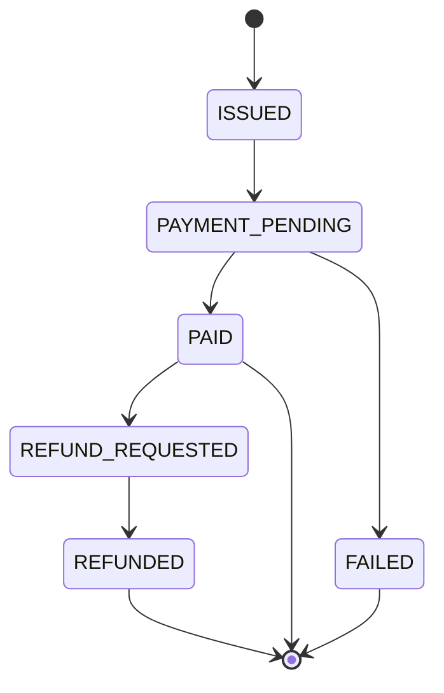
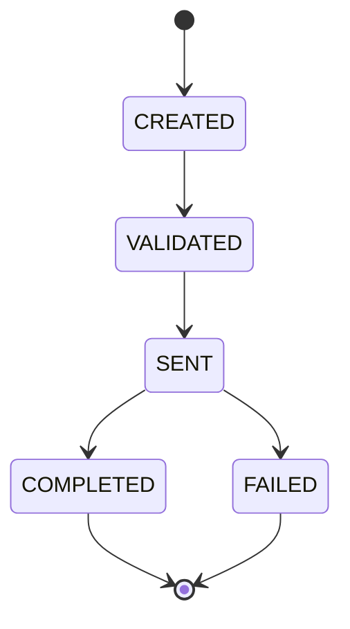
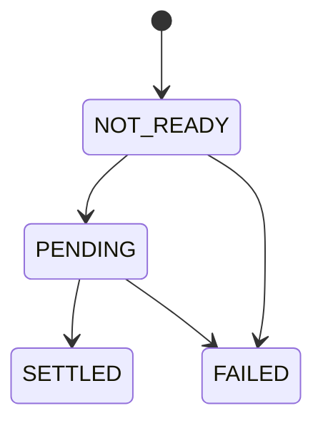
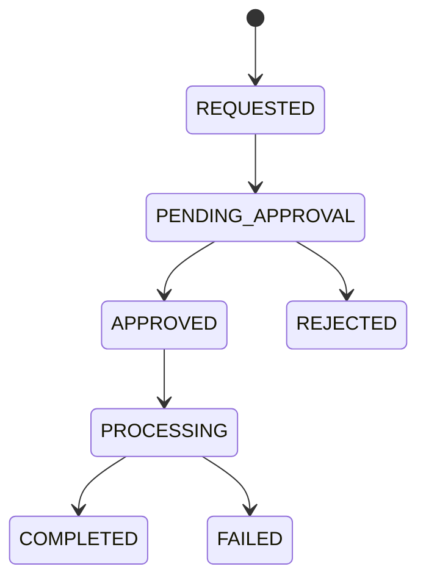

# BND AI Billing and Payment Processing Engine - Engineering Spec & Progress Log

Status: ACTIVE (living document — update it as work progresses)
Version: 3.0
Last Updated: 2026-08-05
Source of Truth: This file for engineering execution status, ownership, schema-as-built,
and API contracts. [product.md](product.md) is the source of truth for product intent,
UX requirements, and the phase plan itself — see Section 1 for how the two relate.

## 1. How to Use This Spec

There are now two top-level spec files, each with a distinct job:

- **[product.md](product.md)** — what to build and why: the product story, the 7-table
  data model rationale, lifecycle rules, UI requirements, demo/debug requirements, and
  the Phase 0-6 plan. If you need to understand *intent*, read it.
- **This file (`spec.md`)** — how the build is actually going: the schema as literally
  implemented in [schema.sql](backend/src/main/resources/schema.sql), the concrete
  request/response contract for every endpoint, who owns which files, current
  implementation status per endpoint/page, and the dated progress log. If you need to
  know *current state* or *exact shapes*, read it.

Any developer or AI agent should be able to open this file and immediately know:
- What phase the project is in and what is done vs. pending (Section 2 — Status
  Dashboard, Section 20 — Progress Log).
- The hard constraints that must never be violated (Section 3).
- The exact schema as built (Section 4), matching `schema.sql` field-for-field.
- The lifecycle/state rules for invoices, payments, settlement, and refunds (Section 5).
- Who owns which files/APIs/pages, Tharan vs. Neha (Section 6).
- The exact request/response contract for every endpoint (Section 7).
- Frontend, demo/debug, security, and seed-data requirements translated into concrete
  engineering tasks (Sections 8-11).
- Testing/branching conventions (Sections 12-13).

Rules:
- If a data shape, endpoint, or dependency is missing here, add it to this spec first —
  do not guess or invent requirements while coding.
- Keep Section 2 (Status Dashboard) and Section 20 (Progress Log) up to date whenever a
  task, endpoint, or page is completed.
- If this file and `product.md` ever disagree on a concrete shape (column name, status
  value, endpoint path), this file wins for "what is actually built"; `product.md` wins
  for "what the product should do" — reconcile by updating whichever is stale.

## 2. Project Status Dashboard

| Phase | Scope | Status | Branch | Notes |
|---|---|---|---|---|
| Phase 0 | Repo cleanup: stale docs/comments, DB credential note, baseline verified | DONE | `fix/pre-phase3-cleanup` (merged to `main`) | 78/78 tests passing baseline; commit `991c4fc` |
| Phase 1 | 7-table schema, FX seam, seed data, this spec rewrite | IN_PROGRESS | `feature/p1-schema-seed` | `schema.sql` rewritten; FX seam (`ExchangeRate`/`ExchangeRateRepository`/`FxConversionService` stub) created; `scripts/generate_data_sql.py` rewritten and `data.sql` regenerated (15 customers / 3 exchange_rates / 175 invoices / 30 payment_methods / 169 payments / 645 history / 23 refunds), verified to load cleanly against a throwaway MySQL DB; `info.md` Section 5 still pending |
| Phase 2 | Backend API evolution (invoice/bootstrap/FX-aware payments/refunds/dashboard) | DONE | `feature/p2-backend` (pushed) | All 7 domains implemented (customer, paymentmethod, invoice, payment, refund, bootstrap, business dashboard); `mvn -o compile` and `mvn -o test-compile` both BUILD SUCCESS. Old pre-redesign tests that targeted the removed 2-table shapes were deleted rather than rewritten - a new test suite for the 7-table model is follow-up work for whoever picks up next |
| Phase 3 | Customer checkout frontend redesign | NOT_STARTED | `feature/p3-user-ui` (planned) | **Assigned to Karuna** |
| Phase 4 | Business ops dashboard frontend redesign | NOT_STARTED | `feature/p4-business-ui` (planned) | **Assigned to Karuna** |
| Phase 5 | Demo/debug mode + edge cases | NOT_STARTED | `feature/p5-demo-debug` (planned) | **Assigned to Neha** |
| Phase 6 | Verification | NOT_STARTED | — | **Assigned to Neha** |

Status values: `NOT_STARTED`, `IN_PROGRESS`, `DONE`, `BLOCKED`.

**Overall project phase: Phase 2 (Backend API Evolution) — DONE.** Backend compiles and
test-compiles cleanly again (`mvn -o compile` / `mvn -o test-compile`, both BUILD
SUCCESS). **Phase 3 (customer checkout UI) is next.**

**Ownership note:** Phases 0-2 (repo cleanup through full backend API evolution) were
owned by Tharan. Starting with Phase 3, remaining work is reassigned:
**Karuna owns Phase 3 (customer checkout UI) and Phase 4 (business ops dashboard UI)**;
**Neha owns Phase 5 (demo/debug mode) and Phase 6 (verification)**, in addition to her
pre-existing multi-currency FX slice (Section 6.1). See Section 6 for the full updated
ownership breakdown.

## 3. Hard Constraints (Non-Negotiable)

Carried over unchanged from the previous phase, plus product.md Section 5's additions:

- Backend stack: Spring Boot + Maven + Java 25.
- Data access: Spring JDBC only (`NamedParameterJdbcTemplate`). No JPA, no Hibernate, no
  Spring Data repositories.
- Database: MySQL only.
- No authentication or authorization code.
- No logging of full account/card numbers; mask sensitive fields everywhere.
- **Never store raw card numbers, CVV, or raw bank account numbers** — only
  `masked_identifier` + `token_ref` (product.md Section 15).
- Frontend only plain HTML/CSS/JS. No frontend frameworks, no bundlers, no build step.
- Exception (unchanged): Bootstrap 5 (CSS + `bundle.js`) and Bootstrap Icons, loaded only
  via CDN `<link>`/`<script>` tags, are explicitly whitelisted. No other UI library
  without a further spec amendment.
- **Keep the schema to exactly 7 tables for this phase** (product.md Section 5) —
  `customers`, `exchange_rates`, `invoices`, `payment_methods`, `payments`,
  `payment_status_history`, `refunds`. No 8th table without a spec amendment.
- No real payment gateway calls, no real live FX calls — exchange rates are
  hardcoded/seeded rows only.
- Business settlement currency is always USD. Customer presentment currency is INR, USD,
  or EUR only.
- Payment methods are `CARD` and `BANK_TRANSFER` only — no UPI/wallets/autopay in this
  phase.
- No endpoint, field, or workflow outside this spec.

## 4. Domain Model and Schema (As Built)

Canonical source: [backend/src/main/resources/schema.sql](backend/src/main/resources/schema.sql).
This section mirrors it — if they ever drift, `schema.sql` is the runtime truth and this
section is stale and must be fixed.

```sql
customers (
  id                CHAR(36) PK,
  customer_ref      VARCHAR(32) UNIQUE,     -- e.g. "CUS-KISHORE-001"
  display_name      VARCHAR(100),
  email             VARCHAR(150) NULL,
  default_currency  VARCHAR(3),             -- INR | USD | EUR
  created_at        TIMESTAMP,
  updated_at        TIMESTAMP
)

exchange_rates (
  id             CHAR(36) PK,
  from_currency  VARCHAR(3),                -- INR | USD | EUR
  to_currency    VARCHAR(3),                -- always USD this phase
  rate           DECIMAL(18,8),
  effective_at   TIMESTAMP,
  source         VARCHAR(40),               -- "SEEDED_DEMO_RATE"
  created_at     TIMESTAMP
)
-- Owner: Neha owns the read-side lookup logic (FxConversionService). Tharan owns the
-- table, seed rows, repository plumbing, and the stub implementation that lets Phase 2
-- backend code compile before Neha's real implementation lands.

invoices (
  id               CHAR(36) PK,
  invoice_number   VARCHAR(32) UNIQUE,      -- e.g. "INV-BND-000001"
  customer_id      CHAR(36) FK -> customers.id,
  product_name     VARCHAR(100),            -- e.g. "BND AI Pro Credits"
  product_code     VARCHAR(32),             -- AI_CREDITS_STARTER | AI_CREDITS_PRO | AI_CREDITS_SCALE
  credit_units     INT,
  subtotal_amount  DECIMAL(18,2),
  gst_amount       DECIMAL(18,2),
  total_amount     DECIMAL(18,2),
  currency         VARCHAR(3),
  status           VARCHAR(24),             -- see Section 5.1
  created_at       TIMESTAMP,
  updated_at       TIMESTAMP
)

payment_methods (
  id                 CHAR(36) PK,
  customer_id        CHAR(36) FK -> customers.id,
  method_type        VARCHAR(20),           -- CARD | BANK_TRANSFER
  display_label      VARCHAR(80),           -- e.g. "Visa ending 4242"
  masked_identifier  VARCHAR(64),           -- e.g. "**** **** **** 4242" / "BANK **** 8921"
  token_ref          VARCHAR(100),          -- e.g. "tok_demo_card_4242"
  provider           VARCHAR(40),           -- "DEMO_TOKENIZER"
  created_at         TIMESTAMP,
  updated_at         TIMESTAMP
)

payments (
  id                 CHAR(36) PK,
  invoice_id         CHAR(36) FK -> invoices.id,
  customer_id        CHAR(36) FK -> customers.id,
  payment_method_id  CHAR(36) NULL FK -> payment_methods.id,
  idempotency_key    VARCHAR(255) UNIQUE,
  amount             DECIMAL(18,2),         -- in `currency`, snapshot of invoice total
  currency           VARCHAR(3),
  exchange_rate_id   CHAR(36) NULL FK -> exchange_rates.id,   -- NULL only when currency = USD
  fx_rate            DECIMAL(18,8),         -- 1.00000000 when currency = USD
  usd_amount         DECIMAL(18,2),         -- BND settlement amount, always USD
  status             VARCHAR(24),           -- see Section 5.2
  settlement_status  VARCHAR(24),           -- see Section 5.3
  error_code         VARCHAR(64) NULL,
  created_at         TIMESTAMP,
  updated_at         TIMESTAMP
)

payment_status_history (       -- unchanged shape from the pre-redesign schema
  id           CHAR(36) PK,
  payment_id   CHAR(36) FK -> payments.id,
  from_status  VARCHAR(24) NULL,
  to_status    VARCHAR(24),
  changed_at   TIMESTAMP,
  triggered_by VARCHAR(64),
  note         VARCHAR(255) NULL,
  seq          BIGINT AUTO_INCREMENT UNIQUE  -- ordering tiebreaker, never exposed via API
)

refunds (
  id                CHAR(36) PK,
  payment_id        CHAR(36) FK -> payments.id,
  amount            DECIMAL(18,2),
  currency          VARCHAR(3),             -- same currency as the parent payment
  usd_amount        DECIMAL(18,2),
  reason            VARCHAR(255) NULL,
  approval_status   VARCHAR(24),            -- see Section 5.4
  status            VARCHAR(24),            -- see Section 5.4
  approved_by       VARCHAR(64) NULL,
  approved_at       TIMESTAMP NULL,
  rejection_reason  VARCHAR(255) NULL,
  created_at        TIMESTAMP,
  updated_at        TIMESTAMP
)
```

Schema invariants:
- Exactly 7 tables, matching product.md Section 7 field-for-field (Section 3).
- All UUID primary keys are generated server-side (`UUID.randomUUID()`), never accepted
  from the client.
- All `TIMESTAMP` columns are UTC. The API never converts timezones; frontend pages
  handle local display conversion if needed.
- `idempotency_key` on `payments` must stay globally unique.
- `payment_status_history` remains append-only — no updates or deletes, ever.
- Monetary values: `DECIMAL(18,2)`. FX rates: `DECIMAL(18,8)`. Converted USD amounts are
  rounded to 2 decimals, HALF_UP.
- `payments.payment_method_id` and `payments.exchange_rate_id` are nullable — a payment
  can in principle be created before a method is fully attached, and USD-currency
  payments have no `exchange_rate_id` row (rate is always exactly `1.00000000`).
- Refunds are their own table with their own primary key — a refund is **not** a
  `payments` row anymore (this is the key structural change vs. the pre-redesign model,
  where a refund was a `payments` row with `type = REFUND`).

## 5. Lifecycle Rules

### 5.1 Invoice Lifecycle



- `DRAFT` exists as a schema-legal status (product.md 7.2) but is not used by the seed
  data or Phase 2 flow yet — an invoice is created directly at `ISSUED`.
- `ISSUED -> PAYMENT_PENDING`: a payment row is created against the invoice.
- `PAYMENT_PENDING -> PAID`: the payment reaches `COMPLETED` (Section 5.2).
- `PAYMENT_PENDING -> FAILED`: the payment reaches `FAILED`.
- `PAID -> REFUND_REQUESTED`: a refund is created against the invoice's completed
  payment (Section 5.4).
- `REFUND_REQUESTED -> REFUNDED`: only once the cumulative approved+completed refund
  amount against the payment equals its full `amount` (partial refunds that don't cover
  the full amount leave the invoice at `PAID`, not a new "partially refunded" status —
  there is no such invoice status in the 7-table model).
- A rejected refund does not change the invoice's status — it stays/returns to `PAID`.

### 5.2 Payment Lifecycle (unchanged core state machine)



- `CREATED -> VALIDATED`: input + invoice validation passed.
- `VALIDATED -> SENT`: simulated processor dispatch (no real gateway).
- `SENT -> COMPLETED` / `SENT -> FAILED`: caller-controlled outcome via the existing
  `ProcessRequest.targetStatus`/`errorCode` convention (unchanged from the prior phase).
- `COMPLETED`/`FAILED` are terminal. No automatic retry — a retried payment is a brand
  new `POST /api/payments` call with a new `idempotencyKey` against the same (or a new)
  invoice.
- Every transition appends one `payment_status_history` row in the same transaction as
  the `payments.status`/`updated_at` update (conditional update + row-count check,
  unchanged concurrency pattern from the prior phase).

### 5.3 Settlement Lifecycle



- A payment starts at `settlement_status = NOT_READY` and stays there through
  `CREATED`/`VALIDATED`/`SENT`, and permanently if the payment ends `FAILED`.
- When a payment reaches `COMPLETED`, settlement may move to `PENDING` immediately or
  stay `PENDING` for a while (seed data intentionally includes both cases so the
  business dashboard has a real "pending settlement" KPI to show).
- Demo mode (Phase 5) may auto-advance `PENDING -> SETTLED` as part of its playback.
- The business dashboard always displays settlement figures in USD (`usd_amount`).

### 5.4 Refund Lifecycle



`refunds.approval_status` and `refunds.status` are two separate fields tracked together:

| approval_status | status | Meaning |
|---|---|---|
| `PENDING_APPROVAL` | `REQUESTED` | Customer requested a refund; awaiting business decision. |
| `APPROVED` | `PROCESSING` | Business approved; refund is being processed. |
| `APPROVED` | `COMPLETED` | Refund fully processed. |
| `APPROVED` | `FAILED` | Refund approved but failed during processing (rare edge case). |
| `REJECTED` | `REJECTED` | Business rejected; `rejection_reason` is set. |

Full rules (carried over and adapted from the prior phase's refund mechanism):

1. A refund may only be created against a payment whose `status = COMPLETED`. Creating
   one against any other payment status is rejected (`InvalidRefundStateException`,
   `409`).
2. Creating a refund inserts a new `refunds` row (`approval_status = PENDING_APPROVAL`,
   `status = REQUESTED`) and moves the parent invoice to `REFUND_REQUESTED`. It does
   **not** modify the `payments` row itself.
3. **Cumulative amount cap:** `amount > 0`, and
   `(sum of amounts of all prior refund rows for this payment_id, any status except
   REJECTED) + (this new refund's amount) <= payments.amount`. Violating this is
   rejected (`409`). This must be computed inside the same transaction as the insert,
   with a row lock on the parent payment, to close the concurrent-refund race window
   (unchanged pattern from the prior phase's Section 8.3).
4. A refund can never be created against another refund — refunds only ever reference
   `payments.id`, never another `refunds.id`, so this is structurally impossible in the
   new schema (an improvement over the prior phase, which had to guard against
   refund-of-refund explicitly).
5. **Approval gate:** a refund cannot proceed past `PENDING_APPROVAL` without an explicit
   `POST /api/refunds/{id}/approve` (Section 7.2) call, moving it to
   `approval_status = APPROVED`, `status = PROCESSING`. `POST /api/refunds/{id}/reject`
   moves it to `approval_status = REJECTED`, `status = REJECTED`, with
   `rejection_reason` required and non-blank.
6. Once `APPROVED`/`PROCESSING`, the refund is marked `COMPLETED` (demo mode may
   auto-advance this; debug mode exposes it as a manual "Complete"/"Fail" action per
   product.md Section 14.2).
7. Every refund action (request, approve, reject, complete) appends a
   `payment_status_history` row against the **parent payment's** `payment_id` with a
   `note` describing the refund action (product.md Section 7.6's "meaningful notes for
   ... refund actions" rule) — `from_status`/`to_status` stay equal to the payment's
   current status (refunds don't change the payment's own status), only the `note` and
   `triggered_by` differ. This is a Phase 2 implementation detail, not yet built.

## 6. Module Ownership

### 6.1 Neha — Multi-Currency Implementation Only (product.md Section 17.1)

Scope, and only this scope:
- `exchange_rates` table read access (repository already scaffolded by Tharan —
  [ExchangeRateRepository.java](backend/src/main/java/com/bnd/payment_processing/payment/repository/ExchangeRateRepository.java) /
  [JdbcExchangeRateRepository.java](backend/src/main/java/com/bnd/payment_processing/payment/repository/JdbcExchangeRateRepository.java)).
- The FX lookup + conversion service:
  [FxConversionService.java](backend/src/main/java/com/bnd/payment_processing/payment/service/FxConversionService.java)
  interface is fixed; replace the body (not the public contract) of
  [FxConversionServiceImpl.java](backend/src/main/java/com/bnd/payment_processing/payment/service/FxConversionServiceImpl.java).
- Currency selection handling wherever it plugs into payment creation.
- USD conversion calculation and rounding.
- `PaymentResponse` fields for `fxRate`/`usdAmount` (once that DTO exists in Phase 2).
- Tests proving INR/EUR/USD -> USD conversion correctness.

Everything else in this document is Tharan's. Do not touch Neha's files/scope without
coordinating first.

### 6.2 Tharan — Phases 0-2 (Complete)

Spec/schema/data generator, invoice feature, payment method masking/token model, the
full Phase 2 backend rewrite (customer/payment-method/invoice/payment/refund domains,
bootstrap endpoint, business dashboard endpoint), and refund workflow. This scope is now
DONE as of Phase 2 completion (Section 2). No further phases are assigned to Tharan
unless reopened by a spec amendment.

### 6.3 Karuna — Phase 3 & Phase 4 (Frontend Redesign)

- **Phase 3**: customer checkout UI (`frontend/frontend-user/`) rebuilt against the new
  `GET /api/bootstrap`, `POST /api/invoices`, `POST /api/payments`,
  `POST /api/payments/{id}/refund` contracts (Section 7).
- **Phase 4**: business ops dashboard UI (`frontend/frontend-business/`) rebuilt against
  `GET /api/business/dashboard`, `GET /api/payments` (search/filter), and the refund
  approve/reject endpoints (Section 7.6-7.8).
- Shared design tokens/lifecycle-timeline updates needed for either phase (Section 8)
  are Karuna's to coordinate, since both phases touch `frontend-shared/`.

### 6.4 Neha — Multi-Currency (Ongoing) + Phase 5 & Phase 6

- Ongoing: the multi-currency FX slice from Section 6.1 (unchanged).
- **Phase 5**: demo/debug mode (product.md Section 14), including any
  `/api/demo/scenarios` endpoints (Section 7.9, optional).
- **Phase 6**: final verification pass (Section 12) across the full Phase 1-5 build.

## 7. API Contract Reference

Status legend: `NOT_IMPLEMENTED`, `IMPLEMENTED` (works, untested), `TESTED` (passing
tests exist). Everything below is `NOT_IMPLEMENTED` as of Phase 1 — this section defines
the target contract for Phase 2, translating product.md Section 10's rough sketch into
concrete shapes. Update the status column as Phase 2 lands each endpoint.

| API | Method | Owner | Purpose | Status |
|---|---|---|---|---|
| `/api/bootstrap` | GET | Tharan | Checkout bootstrap data (customer, BND receiving details, packs, currencies, rates, methods) | IMPLEMENTED |
| `/api/invoices` | POST | Tharan | Create an invoice for a credit pack | IMPLEMENTED |
| `/api/payments` | POST | Tharan (+Neha FX fields) | Create a payment against an invoice | IMPLEMENTED |
| `/api/payments/{id}` | GET | Tharan | Fetch payment by id | IMPLEMENTED |
| `/api/payments` | GET | Tharan | Search/list payments (business) | IMPLEMENTED |
| `/api/payments/{id}/history` | GET | Tharan | Lifecycle timeline | IMPLEMENTED |
| `/api/payments/{id}/process` | POST | Tharan | Advance payment lifecycle one step | IMPLEMENTED |
| `/api/payments/{id}/refund` | POST | Tharan | Request a refund | IMPLEMENTED |
| `/api/refunds/{id}/approve` | POST | Tharan | Approve a refund | IMPLEMENTED |
| `/api/refunds/{id}/reject` | POST | Tharan | Reject a refund | IMPLEMENTED |
| `/api/business/dashboard` | GET | Tharan | Business KPI aggregates | IMPLEMENTED |
| `/api/demo/scenarios` | GET | Neha | List seeded demo scenarios | NOT_IMPLEMENTED (Phase 5) |
| `/api/demo/scenarios/{code}/run` | POST | Neha | Optional: trigger a scenario | NOT_IMPLEMENTED (optional, Phase 5) |

Note: all endpoints marked `IMPLEMENTED` above compile and are wired end-to-end but do
not yet have a rewritten automated test suite (the old tests targeting the pre-redesign
2-table shapes were deleted, not ported) - treat as "implemented, needs tests" until
Phase 6 verification closes that gap.

Global API policy (unchanged from the prior phase):
- No new endpoints outside this table without updating this spec first.
- All error responses use a single `ErrorResponse` shape (`timestamp`, `status`,
  `errorCode`, `message`, `path`).
- CORS must allow the local static frontend dev origins (`CorsConfig.java`).

### 7.1 `GET /api/bootstrap`

Plain English: everything the checkout page needs before it can render, in one call.

```json
{
  "customer": { "id": "uuid", "customerRef": "CUS-KISHORE-001", "displayName": "Kishore", "defaultCurrency": "INR" },
  "bndReceiving": { "merchant": "BND AI", "receivingAccount": "BND-USD-OPERATING-001", "settlementCurrency": "USD" },
  "packs": [
    { "productCode": "AI_CREDITS_STARTER", "productName": "BND AI Starter Credits", "creditUnits": 10000 },
    { "productCode": "AI_CREDITS_PRO", "productName": "BND AI Pro Credits", "creditUnits": 100000 },
    { "productCode": "AI_CREDITS_SCALE", "productName": "BND AI Scale Credits", "creditUnits": 500000 }
  ],
  "currencies": ["INR", "USD", "EUR"],
  "exchangeRates": [
    { "fromCurrency": "USD", "toCurrency": "USD", "rate": 1.00000000 },
    { "fromCurrency": "INR", "toCurrency": "USD", "rate": 0.01205000 },
    { "fromCurrency": "EUR", "toCurrency": "USD", "rate": 1.09000000 }
  ],
  "paymentMethods": ["CARD", "BANK_TRANSFER"]
}
```

### 7.2 `POST /api/invoices`

Request:
```json
{ "customerId": "uuid", "productCode": "AI_CREDITS_PRO", "currency": "INR" }
```
Response `201 Created`:
```json
{
  "id": "uuid", "invoiceNumber": "INV-BND-000123", "customerId": "uuid",
  "productName": "BND AI Pro Credits", "productCode": "AI_CREDITS_PRO", "creditUnits": 100000,
  "subtotalAmount": 7999.00, "gstAmount": 1439.82, "totalAmount": 9438.82,
  "currency": "INR", "status": "ISSUED",
  "createdAt": "2026-08-05T10:00:00Z", "updatedAt": "2026-08-05T10:00:00Z"
}
```
GST is a fixed 18% of `subtotalAmount`, rounded HALF_UP to 2 decimals.

### 7.3 `POST /api/payments`

Request:
```json
{
  "invoiceId": "uuid",
  "customerId": "uuid",
  "paymentMethodType": "CARD",
  "maskedIdentifier": "**** **** **** 4242",
  "tokenRef": "tok_demo_card_4242",
  "currency": "INR",
  "idempotencyKey": "client-generated-uuid-or-key"
}
```
- Server resolves (or creates, if not already stored) a `payment_methods` row from
  `maskedIdentifier`/`tokenRef`/`paymentMethodType` — the raw input never reaches this
  request (masking happens client-side per Section 8).
- Server looks up (via `FxConversionService`) the FX snapshot for `currency`, computing
  `fxRate` and `usdAmount` from `invoices.total_amount`.
- Moves the parent invoice `ISSUED`/`PAYMENT_PENDING` -> `PAYMENT_PENDING`.

Response `201 Created` (or `200 OK` on duplicate `idempotencyKey`):
```json
{
  "id": "uuid", "invoiceId": "uuid", "customerId": "uuid", "paymentMethodId": "uuid",
  "amount": 9438.82, "currency": "INR",
  "fxRate": 0.01205000, "usdAmount": 113.74,
  "status": "CREATED", "settlementStatus": "NOT_READY", "errorCode": null,
  "createdAt": "2026-08-05T10:00:00Z", "updatedAt": "2026-08-05T10:00:00Z"
}
```

### 7.4 `GET /api/payments/{id}` / `GET /api/payments/{id}/history` / `POST /api/payments/{id}/process`

Unchanged in spirit from the prior phase's Section 10.2/10.4/10.5 — same
`ProcessRequest` shape (`targetStatus`/`errorCode`/`note`), same ordered history array
shape — only the `PaymentResponse` body grows the new invoice/FX/settlement fields shown
in Section 7.3.

### 7.5 `POST /api/payments/{id}/refund`

Request:
```json
{ "amount": 4719.41, "reason": "Customer requested refund - duplicate charge" }
```
Response `201 Created` — refund resource (own `id`, `paymentId`, `approvalStatus:
"PENDING_APPROVAL"`, `status: "REQUESTED"`). `409 InvalidRefundStateException` per
Section 5.4 rules 1/3.

### 7.6 `POST /api/refunds/{id}/approve` / `POST /api/refunds/{id}/reject`

Approve request: `{ "approvedBy": "ops-priya", "note": "verified" }` -> `200 OK`,
`approvalStatus: "APPROVED"`, `status: "PROCESSING"`.

Reject request: `{ "rejectedBy": "ops-priya", "reason": "Refund window expired" }` ->
`200 OK`, `approvalStatus: "REJECTED"`, `status: "REJECTED"`, `rejectionReason` set.

### 7.7 `GET /api/payments` (business search/list)

Query params: `status`, `settlementStatus`, `currency`, `customerId`, `invoiceNumber`,
`methodType`, `fromDate`, `toDate`, `page` (default 0), `size` (default 20, max 100).
Response: `{ "content": [...], "page": 0, "size": 20, "totalElements": 169 }`.

### 7.8 `GET /api/business/dashboard`

```json
{
  "totalReceivedUsd": 48213.55,
  "gstCollected": 812345.20,
  "totalInvoices": 175,
  "countByPaymentStatus": { "CREATED": 4, "VALIDATED": 2, "SENT": 3, "COMPLETED": 141, "FAILED": 19 },
  "pendingSettlements": 22,
  "pendingRefundApprovals": 6,
  "recentPayments": [ "... up to N most recent PaymentResponse ..." ]
}
```

### 7.9 `GET /api/demo/scenarios` / `POST /api/demo/scenarios/{code}/run`

Phase 5 scope (product.md Section 14.1) — returns the fixed list of named scenarios
(e.g. `SUCCESSFUL_INR_CARD`, `SUCCESSFUL_EUR_SETTLED_USD`, `USD_BANK_TRANSFER`,
`FAILED_CARD_PAYMENT`, `BANK_TRANSFER_PENDING`, `REFUND_PENDING_APPROVAL`,
`REFUND_APPROVED`, `REFUND_REJECTED`) mapped to specific seeded invoice/payment ids from
`data.sql`'s hand-placed Kishore scenarios (Section 11), so the demo UI can jump straight
to a known-good example without hunting through the dataset.

## 8. Frontend Requirements (Engineering Translation)

Full UX detail lives in product.md Sections 6/12/13 — this section only tracks the
concrete file/page assignments and current build status.

| Page | Path | Phase | Status |
|---|---|---|---|
| Customer checkout | `frontend/frontend-user/index.html` + `script.js`/`styles.css` | 3 | NOT_STARTED (still the pre-redesign M1-era form) |
| Business ops dashboard | `frontend/frontend-business/ops.html` + `ops.js`/`ops.css` | 4 | NOT_STARTED (still the pre-redesign M4-era dashboard) |
| Shared design tokens | `frontend/frontend-shared/design-tokens.css` | 3/4 | NOT_STARTED (still pre-redesign tokens) |
| Shared lifecycle timeline | `frontend/frontend-shared/lifecycle-timeline.js` | 3/4 | NOT_STARTED (needs invoice/FX/settlement/refund-aware rendering) |
| Shared demo/debug toggle | `frontend/frontend-shared/app-mode.js` | 5 | NOT_STARTED |

Style direction (product.md Section 6): calm AI-fintech product, not a generic Bootstrap
admin template — off-white background, charcoal text, muted accents, generous spacing,
subtle borders/shadows, no gradients or flashy animation, polished empty/loading/error/
success states.

## 9. Demo and Debug Mode (Engineering Translation)

Phase 5 scope. Both modes call the exact same Section 7 endpoints — no backend branching
by mode. Demo mode auto-advances via repeated client-side calls to the existing manual
`process`/`refund`/`approve` endpoints with short delays and animated reveal; refunds
still stop at the approval gate (Section 5.4 rule 5) even in Demo mode. Debug mode
disables auto-advance, shows the raw request/response JSON for every call, and exposes
one manual button per transition (`Validate`, `Send`, `Complete`, `Fail`, `Settle`,
`Request refund`, `Approve refund`, `Reject refund`).

## 10. Security and Compliance Guardrails

- Never store raw card numbers, CVV, or raw bank account numbers (Section 3).
- Mask input immediately client-side; only `masked_identifier` + `token_ref` ever reach
  the backend.
- Use fake, clearly-demo token values (`tok_demo_card_4242`, `tok_demo_bank_8921`).
- Never log raw payment method input; business UI shows masked identifiers only.
- Refund/approval/rejection actions must write clear notes into
  `payment_status_history` (Section 5.4 rule 7).
- No secrets in code; DB credentials stay in `application.properties`/`docker-compose.yml`
  (documented local-dev divergence noted inline in both files per Phase 0).

## 11. Seed Data (Mock Data Requirements)

Implemented via [scripts/generate_data_sql.py](scripts/generate_data_sql.py) (rewritten
Phase 1), producing [backend/src/main/resources/data.sql](backend/src/main/resources/data.sql).
Deterministic (fixed random seed, fixed base timestamps, `uuid5`-derived ids) — re-running
the script produces byte-identical output.

Current volume: 15 customers (Kishore + 14 generated), 3 exchange rates, 175 invoices, 30
payment methods, 169 payments, 645 status-history rows, 23 refunds.

Required edge-case coverage, all present via Kishore's 10 hand-placed scenarios plus
randomized bulk data for the other 14 customers:
- INR/USD/EUR invoices across all 3 credit packs (Starter/Pro/Scale), with GST shown.
- Completed payments settled in USD, and completed payments with settlement still
  `PENDING` (not yet `SETTLED`).
- A `FAILED` payment with a retry-guidance note (`INSUFFICIENT_FUNDS`).
- A bank-transfer payment still `SENT` (in-flight, not yet completed).
- A refund `PENDING_APPROVAL`, a refund fully `APPROVED`/`COMPLETED`, and a refund
  `REJECTED` with a `rejection_reason`.
- Two cumulative partial refunds against one payment summing exactly to the full amount
  (invoice ends `REFUNDED`).
- An `ISSUED` invoice with no payment yet (pre-checkout state).
- Bulk randomized invoices/payments/refunds across the other 14 customers for dashboard
  volume and filter/search realism.

Verification: schema.sql + data.sql loaded cleanly into a throwaway MySQL database
(`payment_processing_p1test`) with matching row counts across all 7 tables, then dropped.

## 12. Testing Conventions

- Unit tests for all owned service logic; repository tests for JDBC SQL behavior;
  `MockMvc` tests for controllers and error mapping — same conventions as the prior
  phase, now targeting the new domain shapes.
- Negative-path tests required for: invalid invoice/payment status transitions, invalid
  refund states (wrong payment status, cumulative cap exceeded, missing approval),
  idempotency conflicts.
- FX conversion tests (Neha's scope) must cover INR->USD, EUR->USD, and the USD->USD
  passthrough (`fxRate = 1`, no `exchange_rate_id`).
- `mvn test` gotcha (recorded from Phase 0): the terminal tool can report a misleading
  non-zero exit code even when Maven itself reports `BUILD SUCCESS` — always confirm via
  `$LASTEXITCODE`/the printed banner, not the tool's summary alone.
- MySQL must be available locally for integration tests (`docker compose up -d`, or the
  native Windows MySQL80 service used in this local dev environment — see the credential
  divergence note in `application.pr) -> `feature/p2-backend` (Phase 2, pushed, DONE) ->
`feature/p3-user-ui` (Phase 3, Karuna) -> `feature/p4-business-ui` (Phase 4, Karuna) ->
`feature/p5-demo-debug` (Phase 5, Neha) -> verification (Phase 6, Neha), each merged to
`main` before the next is cut. Phase 1 and Phase 2 are being merged together now that
`feature/p2-backend` restores backend compilation and both branches are greebusiness-ui` -> `feature/p5-demo-debug` ->
verification, each merged to `main` before the next is cut. Phase 1's merge to `main` is
deliberately deferred until Phase 2 restores backend compilation, since merging a
non-compiling backend to `main` would break the baseline for no benefit — Phase 2 will
branch directly off `feature/p1-schema-seed` and both will be merged together once
compilation and tests are green again.

PR policy (unchanged): small PRs, one reviewer minimum, no merge without passing tests
relevant to the changed scope.

## 14. Progress Log

| Date | Entry |
|---|---|
| 2026-08-05 | **Phase 0 complete** (repo cleanup ahead of the product.md v3.0 redesign): fixed a stale/incorrect comment in `frontend/frontend-business/ops.js` claiming the insights/refund-approval endpoints were unmerged/404 (they are live and tested); rewrote `info.md` Sections 2-4 to remove references to deleted legacy frontend pages (`history.html`/`detail.html`/`dashboard.html`/`audit.html`, superseded by `index.html`/`ops.html`); updated `README.md` status section; documented the intentional local-dev DB credential divergence (native MySQL `root`/`n3u3da!` vs. `docker-compose.yml`'s `payment_app`/`payment_app`) inline in both `application.properties` and `docker-compose.yml`, left unfixed per explicit decision; verified baseline `mvn test` = 78/78 passing (`BUILD SUCCESS`, confirmed via `$LASTEXITCODE=0` due to a misleading terminal-tool exit-code quirk with piped/filtered Maven output). Committed as `991c4fc` on `fix/pre-phase3-cleanup`, merged to local `main` (not pushed to origin). |
| 2026-08-05 | **Phase 1 in progress** on `feature/p1-schema-seed`: rewrote `spec.md` from scratch (this file, v3.0) to replace the old 2-table/INR-only/M1-M4 model with the 7-table BND AI Billing model from `product.md` v3.0 — new Status Dashboard (Phase 0-6), new hard constraints, schema-as-built mirroring `schema.sql`, invoice/payment/settlement/refund lifecycle rules, Tharan/Neha ownership split, target API contract for Phase 2 (all `NOT_IMPLEMENTED` pending), frontend/demo/security requirements translated into engineering tasks, seed-data summary, testing/branching conventions carried forward. Old M1-M4 module-owner narrative (Poornima/Neha/Tharan/Karuna) retired — that ownership model belonged to the pre-redesign MVP phase and no longer reflects the current Tharan/Neha-only split. |
| 2026-08-05 | Rewrote `backend/src/main/resources/schema.sql` to the 7-table model (`customers`, `exchange_rates`, `invoices`, `payment_methods`, `payments`, `payment_status_history`, `refunds`), dropping the old `payments` columns (`source_account`, `destination_account`, `type`, `original_payment_id`, `payment_method` enum, `approval_status`, `approved_by`, `approved_at`, `rejection_reason`) in favor of invoice/customer/payment-method/FX linkage plus a dedicated `settlement_status`. This intentionally breaks backend compilation until Phase 2 rewrites the domain code — expected, not a regression. |
| 2026-08-05 | Created the FX seam for Neha: `ExchangeRate` model, `ExchangeRateRepository`/`JdbcExchangeRateRepository` (JDBC, `findLatestRate`/`findById`), `FxConversionResult` record, `FxConversionService` interface (documented as Neha's ownership per product.md 17.1), and a placeholder `FxConversionServiceImpl` stub (USD passthrough at rate 1.0; other currencies do a latest-rate lookup, rounded HALF_UP) so Phase 2 payment-creation code has something to call before Neha's real implementation lands. |
| 2026-08-05 | Rewrote `scripts/generate_data_sql.py` for the 7-table schema and regenerated `backend/src/main/resources/data.sql`: 15 customers (Kishore + 14 generated), 3 exchange rates, 175 invoices, 30 payment methods, 169 payments, 645 status-history rows, 23 refunds — deterministic (fixed seed, fixed base timestamps, `uuid5` ids). Includes Kishore's 10 hand-placed demo scenarios (multi-currency completed/settled payments, a failed payment with retry guidance, an in-flight bank transfer, refund pending/approved/rejected, a cumulative two-part refund reaching the full amount, and a pre-payment `ISSUED` invoice) plus weighted-random bulk data for the other 14 customers. Verified by loading `schema.sql` + `data.sql` into a throwaway MySQL database (`payment_processing_p1test`) — zero errors, row counts matched exactly, database dropped afterward. |

| 2026-08-05 | **Phase 2 complete** on `feature/p2-backend`: rewrote the `payment` package (repository/service/dto/controller) against the new 7-table `Payment` model (invoice/customer/payment-method/FX/settlement-status linkage, replacing the old source/destination-account + embedded-refund model); built the `customer`, `paymentmethod`, and `invoice` domains from scratch (models, JDBC repositories, services, DTOs, controllers); built a new standalone `refund` domain (own table/model/repository/service/controller/DTOs, replacing the old "refund is a payments row" design) with a single-step conditional-update approve flow (`PENDING_APPROVAL` -> `APPROVED`+`COMPLETED` in one UPDATE, since the API contract has no separate refund `/process` step) and invoice-status side effects (`PAID` <-> `REFUND_REQUESTED` <-> `REFUNDED`); added the `bootstrap` package (`GET /api/bootstrap`, assembling the Kishore customer summary, BND receiving-account display, `CreditPackCatalog` packs, supported currencies/payment methods, and seeded exchange rates); added the `business` package (`GET /api/business/dashboard` with a dedicated `BusinessDashboardRepository` for cross-table aggregates - total received USD, GST collected, invoice count, payment-status breakdown, pending settlements, pending refund approvals, recent payments); deleted the obsolete analytics/insights stack (`PaymentAnalyticsService(Impl)`, `PaymentAnalyticsRepository`/Jdbc impl, `PaymentInsightsResponse`) now superseded by the business dashboard; deleted (not rewritten) 6 test files that targeted the removed 2-table shapes (`JdbcPaymentAnalyticsRepositoryTest`, `PaymentAnalyticsServiceImplTest`, `JdbcPaymentRepositoryTest`, `PaymentServiceImplTest`, `GlobalExceptionHandlerTest`, `PaymentQueryControllerRoutingTest`) - a rewritten test suite for the 7-table model is explicitly deferred as follow-up work, tracked in Section 7's API table note. Verified `mvn -o compile` and `mvn -o test-compile` both `BUILD SUCCESS`. Phases 3-6 reassigned: Karuna takes Phase 3 (customer checkout UI) and Phase 4 (business dashboard UI); Neha takes Phase 5 (demo/debug) and Phase 6 (verification) in addition to her ongoing FX scope. Branch `feature/p2-backend` pushed to origin. |